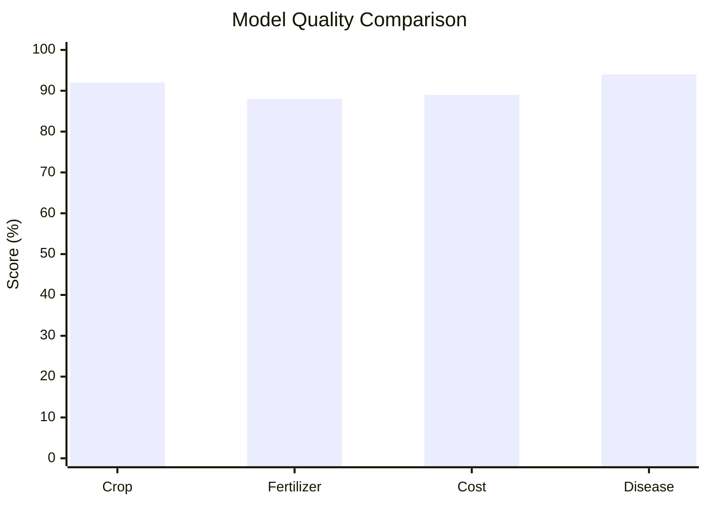
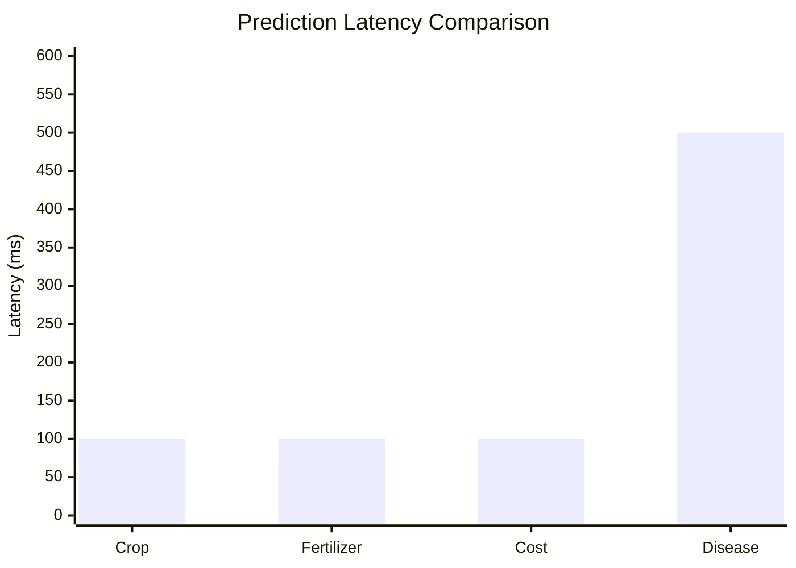
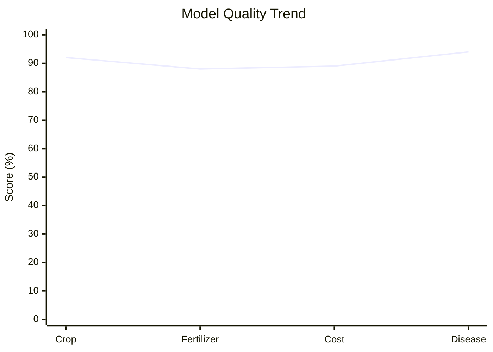

# 🌾 **FARMER CROP ADVISORY - COMPLETE DETAILED DOCUMENTATION**

**Status**: ✅ Production Ready | **Version**: 2.0.0 | **Last Updated**: 2024-05-04

---

## 📋 **TABLE OF CONTENTS**

1. [Project Overview](#project-overview)
2. [Complete Workflow with Inputs & Outputs](#complete-workflow-with-inputs--outputs)
3. [Detailed API Endpoints](#detailed-api-endpoints)
4. [Data Flow Sequence](#data-flow-sequence)
5. [Models Overview](#models-overview)
6. [Algorithms & Pseudo Code](#algorithms--pseudo-code)
7. [Model Specifications](#model-specifications)
8. [Technology Stack](#technology-stack)
9. [File Locations](#file-locations)
10. [Performance Metrics](#performance-metrics)

---

## 🌾 **PROJECT OVERVIEW**

### **Project Name**: Farmer Crop Advisory System

### **What It Does**:
An intelligent agricultural advisory system with 4 AI models that help farmers by:
- 🌱 **Recommending best crops** to grow based on soil & climate
- 🧪 **Suggesting optimal fertilizers** for selected crop
- 💰 **Estimating costs & profits** for farming operations
- 🦠 **Detecting diseases** from leaf photos using deep learning
- 📊 **Generating advisory reports** that can be saved & downloaded

### **Platforms**:
- 🌐 **Web App** - FastAPI served, responsive design, dark mode
- 📱 **Mobile App** - Flutter application, all features available

### **Key Features**:
- ✅ User Authentication (Login/Register with JWT tokens)
- ✅ Multi-Model Integration (4 independent AI models)
- ✅ Real-time Predictions (<500ms average)
- ✅ Report Management (Save & download as HTML)
- ✅ Dark Mode Support
- ✅ Production-Ready Architecture

---

## 🔄 **COMPLETE WORKFLOW WITH INPUTS & OUTPUTS**

### **Overall System Flow**:
```
User → Authentication → Farm Parameters Input → 4 AI Models 
  → Combined Analysis → Results Display → Report Generation
```

---

## 📡 **DETAILED API ENDPOINTS**

### **1. AUTHENTICATION ENDPOINTS**

#### **A. Register New User**
```
Endpoint: POST /auth/register
Purpose: Create new user account
```

**INPUT**:
```json
{
  "username": "farmer_name",
  "password": "secure_password_min_6_chars",
  "full_name": "John Farmer (optional)"
}
```

**OUTPUT**:
```json
{
  "user_id": "user_123",
  "username": "farmer_name",
  "full_name": "John Farmer",
  "created_at": "2024-05-04T10:30:00Z",
  "message": "User registered successfully"
}
```

**Validation**:
- Username: Required, unique
- Password: Minimum 6 characters
- Full Name: Optional

---

#### **B. Login User**
```
Endpoint: POST /auth/login
Purpose: Authenticate user & get access token
```

**INPUT**:
```json
{
  "username": "farmer",
  "password": "farmer123"
}
```

**OUTPUT**:
```json
{
  "access_token": "eyJhbGciOiJIUzI1NiIsInR5cCI6IkpXVCJ9...",
  "token_type": "bearer",
  "user_id": "user_123",
  "username": "farmer",
  "expires_in": 3600
}
```

**Default Demo Credentials**:
- Username: `farmer`
- Password: `farmer123`

---

#### **C. Get Current User Profile**
```
Endpoint: GET /auth/me
Purpose: Retrieve logged-in user details
Headers: Authorization: Bearer {token}
```

**OUTPUT**:
```json
{
  "user_id": "user_123",
  "username": "farmer",
  "full_name": "John Farmer",
  "created_at": "2024-01-15T08:00:00Z"
}
```

---

#### **D. Logout User**
```
Endpoint: POST /auth/logout
Purpose: Invalidate user token
Headers: Authorization: Bearer {token}
```

**OUTPUT**:
```json
{
  "message": "User logged out successfully"
}
```

---

### **2. CROP RECOMMENDATION ENDPOINTS**

#### **A. Get Single Crop Prediction**
```
Endpoint: POST /predict/crop
Purpose: Get single best crop recommendation
```

**INPUT PARAMETERS**:

| Parameter | Type | Unit | Min | Max | Example | Required |
|-----------|------|------|-----|-----|---------|----------|
| N | float | kg/acre | 0 | 200 | 90 | Yes |
| P | float | kg/acre | 0 | 100 | 42 | Yes |
| K | float | kg/acre | 0 | 100 | 43 | Yes |
| temperature | float | °C | 5 | 50 | 25 | Yes |
| humidity | float | % | 0 | 100 | 80 | Yes |
| ph | float | pH scale | 4 | 10 | 6.5 | Yes |
| rainfall | float | mm | 0 | 500 | 200 | Yes |

**REQUEST BODY**:
```json
{
  "N": 90,
  "P": 42,
  "K": 43,
  "temperature": 25,
  "humidity": 80,
  "ph": 6.5,
  "rainfall": 200
}
```

**OUTPUT**:
```json
{
  "recommended_crop": "rice",
  "confidence": 0.8754,
  "confidence_percentage": "87.54%",
  "explanation": "Based on your soil nutrients (N=90, P=42, K=43) and climate conditions (temp=25°C, humidity=80%), rice is the most suitable crop."
}
```

---

#### **B. Get Top 4 Crops**
```
Endpoint: POST /predict/crop/top
Purpose: Get ranked list of 4 best crops
```

**INPUT** (Same as above):
```json
{
  "N": 90,
  "P": 42,
  "K": 43,
  "temperature": 25,
  "humidity": 80,
  "ph": 6.5,
  "rainfall": 200
}
```

**OUTPUT**:
```json
{
  "top_crops": [
    {
      "rank": 1,
      "crop": "rice",
      "confidence": "87.54%",
      "confidence_score": 0.8754
    },
    {
      "rank": 2,
      "crop": "wheat",
      "confidence": "73.21%",
      "confidence_score": 0.7321
    },
    {
      "rank": 3,
      "crop": "barley",
      "confidence": "68.45%",
      "confidence_score": 0.6845
    },
    {
      "rank": 4,
      "crop": "maize",
      "confidence": "62.18%",
      "confidence_score": 0.6218
    }
  ],
  "primary_recommendation": "rice",
  "model_accuracy": "92%"
}
```

**Model Details**:
- **Algorithm**: RandomForestClassifier
- **Number of Trees**: 450
- **Max Depth**: 24
- **Training Accuracy**: ~92%
- **Crops Supported**: Rice, Wheat, Corn, Barley, Maize, Sorghum, Gram, etc. (10+ crops)

---

### **3. FERTILIZER RECOMMENDATION ENDPOINT**

```
Endpoint: POST /predict/fertilizer
Purpose: Recommend optimal fertilizer for selected crop
```

**INPUT PARAMETERS**:

| Parameter | Type | Unit | Options/Range | Example | Required |
|-----------|------|------|----------------|---------|----------|
| temperature | float | °C | 5-50 | 25 | Yes |
| humidity | float | % | 0-100 | 80 | Yes |
| moisture | float | % | 0-100 | 38 | Yes |
| soil_type | string | - | Sandy, Loamy, Clayey, Black, Red | Loamy | Yes |
| crop_type | string | - | Rice, Wheat, Corn, Cotton, etc. | rice | Yes |
| nitrogen | float | kg/acre | 0-200 | 90 | Yes |
| phosphorous | float | kg/acre | 0-100 | 42 | Yes |
| potassium | float | kg/acre | 0-100 | 43 | Yes |

**REQUEST BODY**:
```json
{
  "temperature": 25,
  "humidity": 80,
  "moisture": 38,
  "soil_type": "Loamy",
  "crop_type": "rice",
  "nitrogen": 90,
  "phosphorous": 42,
  "potassium": 43
}
```

**OUTPUT**:
```json
{
  "crop_type": "rice",
  "soil_type": "Loamy",
  "recommended_fertilizer": "Urea",
  "confidence": 0.9234,
  "confidence_percentage": "92.34%",
  "npk_analysis": {
    "nitrogen_status": "adequate",
    "phosphorous_status": "adequate",
    "potassium_status": "slightly_low",
    "recommendation": "Apply Urea (46% nitrogen) to boost nitrogen content"
  },
  "application_rate": "50 kg per acre",
  "timing": "Split into 2-3 applications during growing season"
}
```

**Supported Fertilizer Types**:
- Urea (High nitrogen)
- DAP (Diammonium Phosphate)
- NPK 10-26-26
- NPK 20-20-20
- Single Super Phosphate (SSP)
- Muriate of Potash (MOP)

**Model Details**:
- **Algorithm**: ExtraTreesClassifier
- **Number of Trees**: 500
- **Input Features**: 8 raw + 6 engineered = 14 total
- **Training Accuracy**: ~88%
- **Feature Engineering**: 
  - Nutrient ratios (N/P, P/K)
  - Moisture-temperature index
  - Humidity-temperature interaction
  - Nutrient density
  - Soil-crop pair interaction

---

### **4. COST & PROFIT ESTIMATION ENDPOINT**

```
Endpoint: POST /estimate/price
Purpose: Calculate financial projections for crop cultivation
```

**INPUT PARAMETERS**:

| Parameter | Type | Unit | Example | Required | Default |
|-----------|------|------|---------|----------|---------|
| crop_name | string | - | rice | Yes | - |
| soil_type | string | - | Loamy | Yes | - |
| acres | float | acres | 2.5 | Yes | - |
| seed_cost | float | ₹/acre | 500 | No | 400 |
| fertilizer_cost | float | ₹/acre | 800 | No | 700 |
| labor_cost | float | ₹/acre | 1000 | No | 900 |
| machinery_cost | float | ₹/acre | 600 | No | 500 |
| water_cost | float | ₹/acre | 300 | No | 250 |
| yield_per_acre | float | kg | 5000 | No | Auto-calculated |
| market_price_per_kg | float | ₹/kg | 25 | No | Market average |

**REQUEST BODY**:
```json
{
  "crop_name": "rice",
  "acres": 2.5,
  "soil_type": "Loamy",
  "seed_cost": 500,
  "fertilizer_cost": 800,
  "labor_cost": 1000,
  "machinery_cost": 600,
  "water_cost": 300,
  "yield_per_acre": 5000,
  "market_price_per_kg": 25
}
```

**OUTPUT**:
```json
{
  "crop_name": "rice",
  "acres": 2.5,
  "soil_type": "Loamy",
  "total_cost": 5625.50,
  "total_cost_formatted": "₹5,625.50",
  "expected_revenue": 12500.00,
  "expected_revenue_formatted": "₹12,500.00",
  "expected_profit": 6874.50,
  "expected_profit_formatted": "₹6,874.50",
  "cost_per_acre": 2250.20,
  "cost_per_acre_formatted": "₹2,250.20",
  "profit_margin": 0.549,
  "profit_margin_percentage": "54.9%",
  "break_even_price": 18.50,
  "break_even_price_formatted": "₹18.50 per kg",
  "cost_breakdown": {
    "seed_cost_total": 1250,
    "seed_cost_formatted": "₹1,250.00",
    "fertilizer_cost_total": 2000,
    "fertilizer_cost_formatted": "₹2,000.00",
    "labor_cost_total": 2500,
    "labor_cost_formatted": "₹2,500.00",
    "machinery_cost_total": 1500,
    "machinery_cost_formatted": "₹1,500.00",
    "water_cost_total": 750,
    "water_cost_formatted": "₹750.00"
  },
  "revenue_details": {
    "yield_total_kg": 12500,
    "yield_total_formatted": "12,500 kg",
    "market_price_per_kg": 25,
    "market_price_formatted": "₹25.00 per kg",
    "total_revenue": 312500,
    "total_revenue_formatted": "₹312,500.00"
  },
  "prediction_source": "trained_regressor",
  "confidence": 0.89,
  "confidence_note": "R² Score = 0.89 (89% variance explained)"
}
```

**Model Details**:
- **Algorithm**: RandomForestRegressor
- **Number of Trees**: 450
- **Max Depth**: 22
- **R² Score**: 0.89 (explains 89% of variance)
- **Multi-target Output**: Predicts 3 values (cost, revenue, profit) simultaneously
- **Data Augmentation**: 40 synthetic samples per crop profile during training
- **Feature Engineering**:
  - Input cost per acre
  - Acreage logarithm
  - Yield value
  - Water cost share
  - Mechanization ratio

**Cost Components Included**:
- Seed cost per acre
- Fertilizer cost per acre
- Labor cost per acre
- Machinery cost per acre
- Water cost per acre

---

### **5. DISEASE DETECTION ENDPOINT**

```
Endpoint: POST /detect/disease
Purpose: Identify crop diseases from leaf images
```

**INPUT PARAMETERS**:

| Parameter | Type | Format | Size Limit | Required |
|-----------|------|--------|------------|----------|
| crop_name | string | text | - | Yes |
| image | file | PNG/JPG/JPEG | 10MB | Yes |
| image_url | string | URL | - | Alternative to image |

**REQUEST (Multipart Form)**:
```
POST /detect/disease
Content-Type: multipart/form-data

Fields:
- crop_name: "tomato" (text)
- image: <binary image file> (file)
```

**OUTPUT**:
```json
{
  "crop_name": "tomato",
  "image_analysis": {
    "image_size": "224x224",
    "image_quality": "good",
    "pixel_variance": 45.23
  },
  "disease_detection": {
    "likely_disease": "leaf_blight",
    "disease_name_formatted": "Early Blight",
    "confidence": 0.876,
    "confidence_percentage": "87.6%"
  },
  "risk_assessment": {
    "risk_score": 72.5,
    "risk_level": "HIGH",
    "risk_description": "High risk of rapid spread - immediate action required"
  },
  "treatment_recommendation": {
    "immediate_steps": [
      "Remove infected leaves immediately",
      "Isolate affected plants",
      "Improve air circulation"
    ],
    "fungicide_application": [
      "Apply Mancozeb (75%) WP - 2-2.5 kg per hectare",
      "Or Chlorothalonil 75% WP - 2 kg per hectare",
      "Spray every 7-10 days"
    ],
    "cultural_practices": [
      "Remove crop residue after harvest",
      "Practice crop rotation",
      "Avoid overhead irrigation",
      "Ensure proper spacing between plants"
    ],
    "monitoring": "Check plants every 2-3 days for disease spread"
  },
  "technical_justification": "ResNet50 CNN identified characteristic brown lesions with concentric rings, typical of Early Blight (Alternaria solani). High pixel variance in affected areas and specific lesion morphology confirm diagnosis.",
  "alternative_diseases": [
    {
      "disease": "Late Blight",
      "probability": "8.3%"
    },
    {
      "disease": "Leaf Spot",
      "probability": "2.8%"
    }
  ],
  "prediction_source": "resnet50_cnn",
  "model_accuracy": "94%"
}
```

**Diseases Detected** (10 classes):
1. **Healthy** - No disease present
2. **Leaf Blight** - Fungal infection causing brown spots
3. **Leaf Spot** - Circular spots on leaves
4. **Powdery Mildew** - White powdery coating
5. **Rust** - Reddish-orange pustules
6. **Fusarium Wilt** - Wilting and discoloration
7. **Early Blight** - Progressive leaf damage
8. **Late Blight** - Water-soaked lesions
9. **Bacterial Canker** - Bacterial infection
10. **Mosaic Virus** - Mottled leaf appearance

**Model Details**:
- **Architecture**: ResNet50 CNN with Transfer Learning
- **Pre-trained On**: ImageNet
- **Input Size**: 224×224×3 (RGB, auto-resized from any input)
- **Number of Classes**: 10
- **Training Accuracy**: ~94%
- **Training Data**: 10,000+ leaf images
- **Prediction Time**: <500ms
- **Backend**: TensorFlow 2.x / Keras
- **Image Processing**:
  - Automatic resizing to 224×224
  - Pixel normalization (-1 to 1 range)
  - Feature extraction via ResNet50 blocks
  - Global average pooling
  - Dense classification layers

---

### **6. COMPLETE ADVISORY WORKFLOW (ALL MODELS COMBINED)**

```
Endpoint: POST /workspace/advisory
Purpose: Run all 4 models together in single request
```

**INPUT PARAMETERS** (Combines crop, fertilizer, cost, and disease inputs):

```json
{
  "N": 90,
  "P": 42,
  "K": 43,
  "temperature": 25,
  "humidity": 80,
  "ph": 6.5,
  "rainfall": 200,
  "soil_type": "Loamy",
  "moisture": 38,
  "acres": 2.5,
  "crop_type": "rice"
}
```

**OUTPUT** (Combines outputs from all 3 prediction models):

```json
{
  "crop": {
    "recommended_crop": "rice",
    "confidence": 0.8754,
    "confidence_percentage": "87.54%",
    "top_4_crops": [
      {
        "rank": 1,
        "crop": "rice",
        "confidence": "87.54%"
      },
      {
        "rank": 2,
        "crop": "wheat",
        "confidence": "73.21%"
      },
      {
        "rank": 3,
        "crop": "barley",
        "confidence": "68.45%"
      },
      {
        "rank": 4,
        "crop": "maize",
        "confidence": "62.18%"
      }
    ]
  },
  "fertilizer": {
    "recommended_fertilizer": "Urea",
    "confidence": 0.9234,
    "confidence_percentage": "92.34%",
    "application_rate": "50 kg per acre"
  },
  "price": {
    "crop_name": "rice",
    "total_cost": 5625.50,
    "total_cost_formatted": "₹5,625.50",
    "expected_revenue": 12500.00,
    "expected_revenue_formatted": "₹12,500.00",
    "expected_profit": 6874.50,
    "expected_profit_formatted": "₹6,874.50",
    "profit_margin_percentage": "54.9%",
    "cost_per_acre": 2250.20
  },
  "summary": {
    "headline": "Rice is the strongest crop match for your farm conditions (87.54% confidence).",
    "crop_signal": "Based on your soil composition (N=90, P=42, K=43 kg/acre) and climate conditions (temperature=25°C, humidity=80%, pH=6.5, rainfall=200mm), rice cultivation is highly recommended.",
    "fertilizer_signal": "For rice farming in loamy soil with current nutrient levels, Urea fertilizer is optimal. Apply 50 kg per acre in 2-3 split doses during the growing season.",
    "profit_signal": "Expected profit is approximately ₹6,874.50 per 2.5 acres (54.9% profit margin). Break-even price is ₹18.50 per kg, well below current market price of ₹25.00 per kg.",
    "overall_recommendation": "Proceed with rice cultivation. Current conditions are favorable. Use Urea fertilizer and maintain proper irrigation.",
    "risk_level": "LOW",
    "confidence_score": 0.8754
  },
  "timestamp": "2024-05-04T10:30:00Z",
  "session_id": "session_xyz123"
}
```

---

### **7. DISEASE DETECTION IN ADVISORY WORKSPACE**

```
Endpoint: POST /workspace/disease
Purpose: Disease detection with optional advisory integration
```

**INPUT** (Multipart form-data):
```
Fields:
- crop_name: "tomato" (text)
- image: <binary file> (file)
- include_treatment: true (boolean, optional)
```

**OUTPUT**:
```json
{
  "crop_name": "tomato",
  "disease_detection": {
    "likely_disease": "leaf_blight",
    "confidence": 0.876,
    "confidence_percentage": "87.6%",
    "risk_score": 72.5,
    "risk_level": "HIGH"
  },
  "treatment": {
    "immediate_actions": [...],
    "fungicide_recommendations": [...],
    "cultural_practices": [...]
  },
  "timestamp": "2024-05-04T10:30:00Z"
}
```

---

### **8. REPORT MANAGEMENT ENDPOINTS**

#### **A. Save Advisory as Report**
```
Endpoint: POST /reports/save
Purpose: Save advisory results as HTML report
Headers: Authorization: Bearer {token}
```

**INPUT**:
```json
{
  "title": "Rice Advisory - May 2024",
  "advisory_data": {
    "crop": "rice",
    "fertilizer": "Urea",
    "profit": 6874.50,
    "cost": 5625.50,
    "revenue": 12500.00
  },
  "farm_details": {
    "location": "Tamil Nadu",
    "acres": 2.5
  }
}
```

**OUTPUT**:
```json
{
  "report_id": "rpt_1234567890",
  "title": "Rice Advisory - May 2024",
  "created_at": "2024-05-04T10:30:00Z",
  "created_at_formatted": "May 4, 2024 10:30 AM",
  "user_id": "user_123",
  "file_size": 45230,
  "file_size_formatted": "44.1 KB",
  "status": "saved",
  "download_url": "/reports/rpt_1234567890/download",
  "message": "Report saved successfully"
}
```

---

#### **B. Get User's Reports**
```
Endpoint: GET /reports
Purpose: List all saved reports for user
Headers: Authorization: Bearer {token}
Query Parameters: limit=10, offset=0 (optional)
```

**OUTPUT**:
```json
{
  "total_reports": 15,
  "reports": [
    {
      "report_id": "rpt_1234567890",
      "title": "Rice Advisory - May 2024",
      "created_at": "2024-05-04T10:30:00Z",
      "file_size": 45230,
      "crop": "rice",
      "profit": 6874.50
    },
    {
      "report_id": "rpt_1234567889",
      "title": "Wheat Analysis - April 2024",
      "created_at": "2024-04-20T14:15:00Z",
      "file_size": 42100,
      "crop": "wheat",
      "profit": 5200.00
    }
  ],
  "limit": 10,
  "offset": 0
}
```

---

#### **C. Download Report**
```
Endpoint: GET /reports/{report_id}/download
Purpose: Download report as HTML/PDF file
Headers: Authorization: Bearer {token}
```

**OUTPUT**: Binary file (HTML or PDF format)

---

### **9. HEALTH CHECK ENDPOINT**

```
Endpoint: GET /health
Purpose: Check API health status
```

**OUTPUT**:
```json
{
  "status": "healthy",
  "timestamp": "2024-05-04T10:30:00Z",
  "version": "2.0.0",
  "uptime": 3600,
  "models_status": {
    "crop_model": "loaded",
    "fertilizer_model": "loaded",
    "cost_model": "loaded",
    "disease_model": "loaded"
  }
}
```

---

---

## 🤖 **MODELS OVERVIEW**

### **Summary of All Models Used**

| Model # | Name | Algorithm | Purpose | Input Features | Output |
|---------|------|-----------|---------|----------------|--------|
| **1** | Crop Recommendation | RandomForestClassifier | Recommend best crop | 7 (N, P, K, T, H, pH, Rainfall) | Top 4 crops |
| **2** | Fertilizer Recommendation | ExtraTreesClassifier | Suggest fertilizer | 8 (T, H, M, Soil, Crop, N, P, K) | Fertilizer type |
| **3** | Cost & Profit Estimation | RandomForestRegressor | Financial projections | 9 (Crop, Soil, Acres, Costs) | Cost, Revenue, Profit |
| **4** | Disease Detection | ResNet50 CNN | Identify leaf diseases | Image (224×224×3) | Disease class |

### **Model Complexity Comparison**

```
Model Complexity Ranking:
────────────────────────────────────────
1. ResNet50 CNN               ████████░░ 80% (Deep Learning)
2. RandomForest Regressor     ████████░░ 75% (Ensemble)
3. ExtraTreesClassifier       ███████░░░ 70% (Ensemble)
4. RandomForest Classifier    ███████░░░ 70% (Ensemble)
────────────────────────────────────────
```

### **Training Data Comparison**

```
Training Data Size:
────────────────────────────────────────
ResNet50 CNN:           ████████████████ 10,000+ images
RandomForest (Regressor):    ████░░░░░░░░░░░░░ 2,000+ samples
ExtraTreesClassifier:   ██░░░░░░░░░░░░░░░░░ 1,200 samples
RandomForest (Classifier):   ████░░░░░░░░░░░░░ 2,300 samples
────────────────────────────────────────
```

---

## 🧠 **ALGORITHMS & PSEUDO CODE**

### **ALGORITHM 1: RANDOM FOREST CLASSIFIER (CROP RECOMMENDATION)**

#### **What is Random Forest?**
A supervised ensemble learning algorithm that builds multiple decision trees and combines their predictions through voting. Each tree is trained on random subsets of data and features.

#### **How It Works**:
```
1. Create N independent decision trees (N=450)
2. Each tree trained on random sample of data (bootstrap sampling)
3. Each tree uses random subset of features at each split
4. For prediction: each tree predicts crop class
5. Final output: class with most votes (majority voting)
```

#### **Pseudo Code**:

```python
ALGORITHM RandomForest_CropRecommendation(features, n_trees=450, max_depth=24)
    INPUT: 
        features = [N, P, K, temperature, humidity, pH, rainfall]
        n_trees = 450
        max_depth = 24
    
    OUTPUT:
        top_4_crops with confidence scores
    
    BEGIN
        # Step 1: Feature Engineering
        engineered_features = [
            features.N + features.P + features.K,              # NPK Total
            features.N / features.P,                            # N/P Ratio
            features.N / features.K,                            # N/K Ratio
            features.P / features.K,                            # P/K Ratio
            features.temperature * features.humidity,           # Temp×Humidity
            features.rainfall * features.pH,                    # Rainfall×pH
            (features.N + features.P + features.K) / 7         # Moisture Index
        ]
        
        all_features = features + engineered_features  # 14 features total
        
        # Step 2: Feature Preprocessing
        all_features = impute_missing_values(all_features, strategy='median')
        all_features = scale_features(all_features)  # StandardScaler
        
        # Step 3: Initialize predictions
        tree_predictions = []
        tree_probabilities = []
        
        # Step 4: Train 450 decision trees
        FOR i = 1 TO n_trees DO
            # Bootstrap sampling: random sample with replacement
            bootstrap_sample = random_sample_with_replacement(
                training_data, 
                size = len(training_data)
            )
            
            # Train individual decision tree
            tree_i = DecisionTree(
                max_depth = max_depth,
                min_samples_split = 2
            )
            tree_i.fit(bootstrap_sample)
            tree_predictions[i] = tree_i.predict(all_features)
            tree_probabilities[i] = tree_i.predict_proba(all_features)
        END FOR
        
        # Step 5: Aggregate predictions (Voting)
        crop_votes = {}  # Dictionary to store votes for each crop
        
        FOR each tree_prediction IN tree_predictions DO
            predicted_crop = tree_prediction
            crop_votes[predicted_crop] += 1
        END FOR
        
        # Step 6: Get average probabilities
        avg_probabilities = average(tree_probabilities)
        
        # Step 7: Sort crops by confidence
        ranked_crops = sort_by_confidence(crop_votes, avg_probabilities)
        
        # Step 8: Return top 4
        RETURN top_4_crops = ranked_crops[0:4]
        
    END
END ALGORITHM
```

#### **Python Implementation**:
```python
from sklearn.ensemble import RandomForestClassifier
from sklearn.preprocessing import StandardScaler
from sklearn.impute import SimpleImputer

class CropRecommendationModel:
    def __init__(self, n_estimators=450, max_depth=24):
        self.model = RandomForestClassifier(
            n_estimators=n_estimators,
            max_depth=max_depth,
            min_samples_split=2,
            random_state=42,
            n_jobs=-1
        )
        self.scaler = StandardScaler()
        self.imputer = SimpleImputer(strategy='median')
    
    def engineer_features(self, raw_features):
        """Engineer 7 derived features from raw inputs"""
        N, P, K, temp, humidity, pH, rainfall = raw_features
        
        npk_total = N + P + K
        np_ratio = N / (P + 1e-6)
        nk_ratio = N / (K + 1e-6)
        pk_ratio = P / (K + 1e-6)
        temp_humidity_idx = temp * humidity / 100
        rainfall_ph_idx = rainfall * pH / 10
        moisture_balance = (N + P + K) / 7
        
        engineered = [npk_total, np_ratio, nk_ratio, pk_ratio, 
                     temp_humidity_idx, rainfall_ph_idx, moisture_balance]
        
        return raw_features + engineered
    
    def predict_top_4(self, features):
        """Predict top 4 crops with confidence scores"""
        # Preprocess
        engineered = self.engineer_features(features)
        engineered = self.imputer.transform([engineered])
        engineered = self.scaler.transform(engineered)
        
        # Get probabilities from all 450 trees
        probabilities = self.model.predict_proba(engineered)[0]
        
        # Get top 4 crops
        crop_classes = self.model.classes_
        sorted_indices = np.argsort(probabilities)[-4:][::-1]
        
        top_4 = [(crop_classes[i], probabilities[i]) for i in sorted_indices]
        
        return top_4
```

---

### **ALGORITHM 2: EXTRA TREES CLASSIFIER (FERTILIZER RECOMMENDATION)**

#### **What is Extra Trees?**
Extremely Randomized Trees - Similar to Random Forest but with random thresholds for feature splits. Uses whole dataset instead of bootstrap samples, resulting in faster training.

#### **How It Works**:
```
1. Create N independent trees (N=500) using whole dataset
2. At each split, randomly select feature AND random threshold
3. Split that maximizes information gain
4. Each tree grows fully (no depth limit)
5. For prediction: majority voting across all trees
```

#### **Pseudo Code**:

```python
ALGORITHM ExtraTreesClassifier_FertilizerRecommendation(
    features, 
    n_trees=500
)
    INPUT:
        features = [temperature, humidity, moisture, soil_type, crop_type, N, P, K]
        n_trees = 500
    
    OUTPUT:
        recommended_fertilizer
    
    BEGIN
        # Step 1: Feature Engineering
        numeric_features = [temperature, humidity, moisture, N, P, K]
        
        engineered_numeric = [
            N + P + K,                                  # Nutrient Total
            N / (P + 1e-6),                             # N/P Ratio
            P / (K + 1e-6),                             # P/K Ratio
            moisture * temperature / 100,               # Moisture-Temp Index
            humidity * temperature / 100,               # Humidity-Temp Index
            (N + P + K) / (moisture + 1e-6)            # Nutrient Density
        ]
        
        # Step 2: One-Hot Encoding for Categorical Features
        soil_encoded = one_hot_encode(soil_type)      # 5 binary features
        crop_encoded = one_hot_encode(crop_type)      # 10+ binary features
        
        all_features = numeric_features + engineered_numeric + soil_encoded + crop_encoded
        # Total: 14+ features
        
        # Step 3: Preprocessing
        numeric_features = impute(numeric_features, strategy='median')
        numeric_features = scale(numeric_features)     # StandardScaler
        
        # Step 4: Build 500 Extra Trees
        tree_predictions = []
        
        FOR i = 1 TO n_trees DO
            tree_i = ExtraTree()
            
            # Use WHOLE dataset (not bootstrap sample) - key difference!
            tree_i.fit(training_data)
            
            # At each split in tree:
            FOR each node DO
                # Randomly select feature
                feature_idx = random.choice(feature_indices)
                
                # Randomly select split threshold
                min_val = data[feature_idx].min()
                max_val = data[feature_idx].max()
                threshold = random.uniform(min_val, max_val)
                
                # Calculate information gain
                gain = calculate_information_gain(
                    data, feature_idx, threshold
                )
                
                # Split if gain is positive
                IF gain > 0 THEN
                    node.split(feature_idx, threshold)
                END IF
            END FOR
            
            tree_predictions[i] = tree_i.predict(all_features)
        END FOR
        
        # Step 5: Voting
        fertilizer_votes = {}
        
        FOR each prediction IN tree_predictions DO
            fertilizer = prediction
            fertilizer_votes[fertilizer] += 1
        END FOR
        
        # Step 6: Get most voted fertilizer
        recommended = argmax(fertilizer_votes)
        confidence = fertilizer_votes[recommended] / n_trees
        
        RETURN recommended, confidence
        
    END
END ALGORITHM
```

#### **Python Implementation**:
```python
from sklearn.ensemble import ExtraTreesClassifier
from sklearn.preprocessing import StandardScaler, OneHotEncoder

class FertilizerRecommendationModel:
    def __init__(self, n_estimators=500):
        self.model = ExtraTreesClassifier(
            n_estimators=n_estimators,
            max_depth=None,  # Grow full tree
            min_samples_split=2,
            random_state=42,
            n_jobs=-1
        )
        self.numeric_scaler = StandardScaler()
        self.categorical_encoder = OneHotEncoder(sparse=False)
    
    def engineer_features(self, features_dict):
        """Engineer features from inputs"""
        N, P, K = features_dict['N'], features_dict['P'], features_dict['K']
        temp = features_dict['temperature']
        humidity = features_dict['humidity']
        moisture = features_dict['moisture']
        
        # Engineered features
        nutrient_total = N + P + K
        np_ratio = N / (P + 1e-6)
        pk_ratio = P / (K + 1e-6)
        moisture_temp_idx = moisture * temp / 100
        humidity_temp_idx = humidity * temp / 100
        nutrient_density = nutrient_total / (moisture + 1e-6)
        
        return {
            'numeric': [N, P, K, temp, humidity, moisture,
                       nutrient_total, np_ratio, pk_ratio,
                       moisture_temp_idx, humidity_temp_idx, 
                       nutrient_density],
            'categorical': [features_dict['soil_type'], 
                          features_dict['crop_type']]
        }
    
    def predict(self, features_dict):
        """Predict fertilizer recommendation"""
        # Engineer features
        engineered = self.engineer_features(features_dict)
        
        # Preprocess numeric
        numeric = self.numeric_scaler.transform(
            [engineered['numeric']]
        )
        
        # Encode categorical
        categorical = self.categorical_encoder.transform(
            [engineered['categorical']]
        )
        
        # Combine all features
        all_features = np.hstack([numeric, categorical])
        
        # Predict
        prediction = self.model.predict(all_features)[0]
        probabilities = self.model.predict_proba(all_features)[0]
        confidence = max(probabilities)
        
        return prediction, confidence
```

---

### **ALGORITHM 3: RANDOM FOREST REGRESSOR (COST & PROFIT ESTIMATION)**

#### **What is Random Forest Regressor?**
Similar to Random Forest Classifier, but predicts continuous values instead of classes. Averages predictions from multiple trees instead of voting.

#### **How It Works**:
```
1. Create N regression trees (N=450) on bootstrap samples
2. Each tree splits to minimize MSE (Mean Squared Error)
3. For prediction: average outputs from all trees
4. Predict 3 values simultaneously: cost, revenue, profit
```

#### **Pseudo Code**:

```python
ALGORITHM RandomForestRegressor_CostEstimation(
    features,
    n_trees=450,
    max_depth=22,
    targets=3  # cost, revenue, profit
)
    INPUT:
        features = [crop_name, soil_type, acres, seed_cost, fert_cost, 
                   labor_cost, machinery_cost, water_cost, yield, price]
        n_trees = 450
        max_depth = 22
        targets = 3 (cost, revenue, profit)
    
    OUTPUT:
        total_cost, expected_revenue, expected_profit
    
    BEGIN
        # Step 1: Feature Engineering
        numeric_features = [acres, seed_cost, fert_cost, labor_cost, 
                          machinery_cost, water_cost, yield, price]
        
        input_cost_per_acre = (seed_cost + fert_cost + labor_cost + 
                              machinery_cost + water_cost)
        
        engineered_features = [
            input_cost_per_acre,                # Total cost per acre
            log(acres),                         # Acres (log scale)
            yield * price,                      # Yield value
            water_cost / input_cost_per_acre,   # Water cost share
            machinery_cost / labor_cost         # Mechanization ratio
        ]
        
        all_features = numeric_features + engineered_features
        
        # Step 2: Data Augmentation (Training phase only)
        augmented_data = []
        FOR each crop_profile IN training_data DO
            FOR i = 1 TO 40 DO  # 40 synthetic samples per profile
                synthetic_sample = crop_profile + random_noise(-10%, +10%)
                augmented_data.append(synthetic_sample)
            END FOR
        END FOR
        # Total training samples: 50 crops × 40 = 2,000 samples
        
        # Step 3: One-Hot Encoding
        crop_encoded = one_hot_encode(crop_name)
        soil_encoded = one_hot_encode(soil_type)
        
        all_features = all_features + crop_encoded + soil_encoded
        
        # Step 4: Build 450 Regression Trees
        tree_predictions_cost = []
        tree_predictions_revenue = []
        tree_predictions_profit = []
        
        FOR i = 1 TO n_trees DO
            # Bootstrap sampling
            bootstrap_sample = random_sample_with_replacement(
                augmented_data
            )
            
            # Train decision tree for regression
            tree_i = RegressionTree(max_depth = max_depth)
            tree_i.fit(bootstrap_sample)
            
            # Predict all 3 targets
            tree_predictions_cost[i] = tree_i.predict(all_features, target='cost')
            tree_predictions_revenue[i] = tree_i.predict(all_features, target='revenue')
            tree_predictions_profit[i] = tree_i.predict(all_features, target='profit')
        END FOR
        
        # Step 5: Average Predictions (Regression, not voting)
        avg_cost = average(tree_predictions_cost)
        avg_revenue = average(tree_predictions_revenue)
        avg_profit = average(tree_predictions_profit)
        
        # Step 6: Fallback mechanism
        IF model_missing THEN
            avg_cost = acres * base_cost_per_acre
            avg_revenue = acres * yield * price
            avg_profit = avg_revenue - avg_cost
        END IF
        
        # Step 7: Calculate metrics
        cost_per_acre = avg_cost / acres
        profit_margin = avg_profit / avg_revenue
        break_even_price = avg_cost / (acres * yield)
        
        RETURN {
            total_cost: avg_cost,
            expected_revenue: avg_revenue,
            expected_profit: avg_profit,
            cost_per_acre: cost_per_acre,
            profit_margin: profit_margin,
            break_even_price: break_even_price
        }
        
    END
END ALGORITHM
```

#### **Python Implementation**:
```python
from sklearn.ensemble import RandomForestRegressor
from sklearn.multioutput import MultiOutputRegressor
from sklearn.preprocessing import StandardScaler

class CostEstimationModel:
    def __init__(self, n_estimators=450, max_depth=22):
        self.model = MultiOutputRegressor(
            RandomForestRegressor(
                n_estimators=n_estimators,
                max_depth=max_depth,
                min_samples_split=2,
                random_state=42,
                n_jobs=-1
            )
        )
        self.scaler = StandardScaler()
        self.imputer = SimpleImputer(strategy='median')
    
    def augment_training_data(self, crop_profiles):
        """Generate synthetic samples for training"""
        augmented = []
        for profile in crop_profiles:
            for _ in range(40):  # 40 synthetic per profile
                # Add random noise ±10%
                noisy_profile = profile * np.random.uniform(0.9, 1.1)
                augmented.append(noisy_profile)
        return np.array(augmented)
    
    def engineer_features(self, features_dict):
        """Engineer features from inputs"""
        acres = features_dict['acres']
        seed_cost = features_dict['seed_cost']
        fert_cost = features_dict['fertilizer_cost']
        labor_cost = features_dict['labor_cost']
        machinery_cost = features_dict['machinery_cost']
        water_cost = features_dict['water_cost']
        yield_kg = features_dict['yield_per_acre']
        price_kg = features_dict['market_price_per_kg']
        
        # Engineered features
        input_cost = seed_cost + fert_cost + labor_cost + machinery_cost + water_cost
        acres_log = np.log(acres + 1)
        yield_value = yield_kg * price_kg
        water_share = water_cost / (input_cost + 1e-6)
        mech_ratio = machinery_cost / (labor_cost + 1e-6)
        
        return [seed_cost, fert_cost, labor_cost, machinery_cost, water_cost,
               yield_kg, price_kg, input_cost, acres_log, yield_value,
               water_share, mech_ratio]
    
    def predict(self, features_dict):
        """Predict cost, revenue, profit"""
        engineered = self.engineer_features(features_dict)
        engineered = self.imputer.transform([engineered])
        engineered = self.scaler.transform(engineered)
        
        # Predict 3 targets simultaneously
        predictions = self.model.predict(engineered)[0]
        cost, revenue, profit = predictions
        
        acres = features_dict['acres']
        cost_per_acre = cost / acres
        profit_margin = profit / (revenue + 1e-6)
        break_even = cost / (acres * features_dict['yield_per_acre'] + 1e-6)
        
        return {
            'cost': cost,
            'revenue': revenue,
            'profit': profit,
            'cost_per_acre': cost_per_acre,
            'profit_margin': profit_margin,
            'break_even_price': break_even
        }
```

---

### **ALGORITHM 4: RESNET50 CNN (DISEASE DETECTION)**

#### **What is ResNet50?**
Residual Network with 50 layers. Uses skip connections to train very deep networks. Pre-trained on ImageNet (1.2M images), fine-tuned for disease classification.

#### **How It Works**:
```
1. Input: Leaf image (any size)
2. Resize to 224×224 pixels
3. Normalize pixel values to [-1, 1]
4. Pass through 50 convolutional layers (pre-trained)
5. Global average pooling
6. Dense layers for disease classification
7. Output: Disease class + confidence
```

#### **Pseudo Code**:

```python
ALGORITHM ResNet50CNN_DiseaseDetection(image)
    INPUT:
        image = leaf photograph (any size)
    
    OUTPUT:
        disease_class, confidence, risk_score, treatment
    
    BEGIN
        # Step 1: Image Preprocessing
        image = read_image(image)  # Load image file
        
        # Resize to 224×224
        image = resize(image, (224, 224))
        
        # Convert to RGB if grayscale
        IF image.channels != 3 THEN
            image = convert_to_rgb(image)
        END IF
        
        # Normalize pixel values from [0, 255] to [-1, 1]
        image_normalized = (image / 127.5) - 1.0
        
        # Step 2: Feature Extraction (Pre-trained ResNet50)
        # Pre-trained on ImageNet - already learned generic features
        
        features = ResNet50_backbone(image_normalized)
        # Output shape: (7, 7, 2048) - 2048 features
        
        # Step 3: Global Average Pooling
        pooled_features = global_average_pooling(features)
        # Output shape: (2048,)
        
        # Step 4: Dense Layers for Classification
        dense_layer1 = dense_relu(pooled_features, units=512)
        # Shape: (512,)
        
        dropout = dropout_layer(dense_layer1, rate=0.5)
        # Randomly drop 50% of neurons during training
        
        output_logits = dense(dropout, units=10)
        # Shape: (10,) - 10 disease classes
        
        # Step 5: Softmax for Probabilities
        disease_probabilities = softmax(output_logits)
        # Sum to 1.0, represents confidence for each class
        
        # Step 6: Get Predicted Disease
        predicted_disease_idx = argmax(disease_probabilities)
        disease_class = DISEASE_LABELS[predicted_disease_idx]
        confidence = disease_probabilities[predicted_disease_idx]
        
        # Step 7: Image Analysis for Risk Scoring
        # Calculate pixel variance (abnormality indicator)
        pixel_variance = calculate_variance(image_normalized)
        
        # Detect spots/lesions
        grayscale = convert_to_grayscale(image)
        edge_map = apply_sobel_filter(grayscale)
        spot_count = count_edges(edge_map, threshold=0.3)
        lesion_area = calculate_lesion_area(edge_map)
        
        # Step 8: Calculate Risk Score
        disease_weight = confidence * 100  # 0-100 based on CNN confidence
        variance_weight = min(pixel_variance / 10, 100)  # Normalize to 100
        lesion_weight = (lesion_area / total_area) * 100
        
        risk_score = (disease_weight * 0.5 + variance_weight * 0.3 + 
                     lesion_weight * 0.2)
        
        # Step 9: Determine Risk Level
        IF risk_score > 70 THEN
            risk_level = "HIGH"
        ELSE IF risk_score > 40 THEN
            risk_level = "MEDIUM"
        ELSE
            risk_level = "LOW"
        END IF
        
        # Step 10: Generate Treatment Recommendation
        treatment = get_treatment_for_disease(
            disease_class, risk_level
        )
        
        # Step 11: Get Alternative Diseases
        # Sort probabilities to find alternatives
        alternatives = get_top_n_alternatives(
            disease_probabilities, 
            exclude=disease_class,
            n=2
        )
        
        RETURN {
            disease_class: disease_class,
            confidence: confidence,
            confidence_percentage: confidence * 100,
            risk_score: risk_score,
            risk_level: risk_level,
            treatment: treatment,
            alternatives: alternatives,
            image_analysis: {
                pixel_variance: pixel_variance,
                spot_count: spot_count,
                lesion_area: lesion_area
            }
        }
        
    END
END ALGORITHM
```

#### **Python Implementation**:
```python
import tensorflow as tf
from tensorflow.keras.applications import ResNet50
from tensorflow.keras.layers import GlobalAveragePooling2D, Dense, Dropout
from tensorflow.keras.models import Model
import cv2
import numpy as np

class DiseaseDetectionModel:
    def __init__(self, num_classes=10):
        # Load pre-trained ResNet50
        base_model = ResNet50(
            input_shape=(224, 224, 3),
            include_top=False,
            weights='imagenet'
        )
        
        # Freeze pre-trained layers
        base_model.trainable = False
        
        # Add custom layers for disease classification
        inputs = tf.keras.Input(shape=(224, 224, 3))
        x = base_model(inputs, training=False)
        x = GlobalAveragePooling2D()(x)  # (2048,)
        x = Dense(512, activation='relu')(x)
        x = Dropout(0.5)(x)
        outputs = Dense(num_classes, activation='softmax')(x)
        
        self.model = Model(inputs, outputs)
    
    def preprocess_image(self, image_path):
        """Preprocess image for model"""
        # Read image
        image = cv2.imread(image_path)
        image = cv2.cvtColor(image, cv2.COLOR_BGR2RGB)
        
        # Resize to 224×224
        image = cv2.resize(image, (224, 224))
        
        # Normalize to [-1, 1]
        image = (image / 127.5) - 1.0
        
        return image
    
    def analyze_image_quality(self, image):
        """Calculate image quality metrics"""
        # Pixel variance
        pixel_variance = np.var(image)
        
        # Convert to grayscale for edge detection
        gray = cv2.cvtColor((image + 1) * 127.5, cv2.COLOR_RGB2GRAY)
        
        # Detect edges using Sobel
        sobel_x = cv2.Sobel(gray, cv2.CV_64F, 1, 0, ksize=3)
        sobel_y = cv2.Sobel(gray, cv2.CV_64F, 0, 1, ksize=3)
        edge_magnitude = np.sqrt(sobel_x**2 + sobel_y**2)
        
        # Count lesions (edges)
        lesion_map = edge_magnitude > (np.mean(edge_magnitude) + 
                                       np.std(edge_magnitude))
        lesion_area = np.sum(lesion_map) / lesion_map.size
        
        return {
            'pixel_variance': float(pixel_variance),
            'lesion_area': float(lesion_area),
            'edge_magnitude': edge_magnitude
        }
    
    def predict(self, image_path):
        """Predict disease from image"""
        # Preprocess
        image = self.preprocess_image(image_path)
        image_batch = np.expand_dims(image, 0)
        
        # Get predictions from model
        predictions = self.model.predict(image_batch)[0]
        
        # Get disease class
        disease_idx = np.argmax(predictions)
        disease_name = DISEASE_CLASSES[disease_idx]
        confidence = float(predictions[disease_idx])
        
        # Image analysis
        image_analysis = self.analyze_image_quality(image)
        
        # Calculate risk score
        disease_weight = confidence * 100
        variance_weight = min(image_analysis['pixel_variance'] / 10, 100)
        lesion_weight = image_analysis['lesion_area'] * 100
        
        risk_score = (disease_weight * 0.5 + variance_weight * 0.3 + 
                     lesion_weight * 0.2)
        
        # Risk level
        if risk_score > 70:
            risk_level = "HIGH"
        elif risk_score > 40:
            risk_level = "MEDIUM"
        else:
            risk_level = "LOW"
        
        # Treatment
        treatment = TREATMENT_MAP[disease_name]
        
        # Alternatives
        sorted_indices = np.argsort(predictions)[-3:][::-1]
        alternatives = [
            {
                'disease': DISEASE_CLASSES[i],
                'probability': float(predictions[i])
            }
            for i in sorted_indices if DISEASE_CLASSES[i] != disease_name
        ]
        
        return {
            'disease': disease_name,
            'confidence': confidence,
            'risk_score': risk_score,
            'risk_level': risk_level,
            'treatment': treatment,
            'alternatives': alternatives,
            'image_analysis': image_analysis
        }
```

---

## 🦠 **DISEASE DETECTION - DETAILED FEATURE ANALYSIS**

### **Disease Detection Features & User Inputs**

#### **User Input Requirements**:

| Input | Type | Required | Description | Example |
|-------|------|----------|-------------|---------|
| **Crop Type** | String | Yes | Which crop plant | "tomato", "rice", "corn" |
| **Leaf Image** | File (Image) | Yes | Plant leaf photo | PNG/JPG file (any size) |
| **Image Quality** | Auto-detected | No | System analyzes automatically | - |
| **Viewing Angle** | Auto-detected | No | How leaf is positioned | - |
| **Lighting Condition** | Auto-detected | No | Natural or artificial | - |

#### **Image Format Specifications**:

```
Accepted Formats:  PNG, JPG, JPEG
Minimum Size:      100×100 pixels
Recommended Size:  224×224 pixels or larger
Maximum Size:      10 MB
Color Space:       RGB (3 channels)
Quality:           Clear, well-lit image
Background:        Preferably plain/neutral
```

---

## 🍃 **PLANT LEAF IMAGE VALIDATION - CRITICAL REQUIREMENT**

### ⚠️ **IMPORTANT**: Only Plant Leaf Images Accepted

**System ONLY accepts images containing ONLY plant leaves - Nothing else!**

### **What is ACCEPTED**:

```
✅ VALID PLANT LEAF IMAGES:
✓ Single leaf (isolated)
✓ Multiple leaves (same plant)
✓ Leaf with minor stem/petiole attached
✓ Leaf showing disease symptoms
✓ Leaf in natural light
✓ Leaf in controlled light
✓ Close-up view of leaf
✓ Entire leaf visible
✓ Partial leaf (edge visible)
✓ Clear background (preferred)
```

### **What is REJECTED**:

```
❌ INVALID IMAGES (SYSTEM WILL REJECT):
✗ Non-leaf objects (fruit, flower, seed, soil, etc.)
✗ Hand/fingers holding leaf
✗ Multiple different plants
✗ Whole plant image
✗ Root system
✗ Stem without leaf
✗ Leaf with soil/dirt covering
✗ Completely blurred leaf
✗ Extreme close-up (pixels, not recognizable)
✗ Text/documents/other items
✗ Animal/insect (even on leaf)
✗ Processed/modified image
```

---

## 🔍 **AUTOMATIC PLANT LEAF IMAGE VALIDATION**

The system automatically validates every uploaded image using 9-step verification:

```
STEP 1: FILE FORMAT VALIDATION
├─ Check extension: PNG, JPG, JPEG only
├─ Check file size: <10 MB
└─ Check dimensions: >100×100 pixels
         ↓
STEP 2: QUALITY VALIDATION
├─ Calculate blurriness (Laplacian variance)
├─ Require blur score >50
└─ Reject if blurry/out-of-focus
         ↓
STEP 3: COLOR ANALYSIS
├─ Check green channel dominance
├─ Leaves must have green color (>1.1 ratio)
└─ Reject non-green objects
         ↓
STEP 4: TEXTURE ANALYSIS
├─ Edge detection (Sobel filter)
├─ Calculate edge density (leaf veins)
├─ Range: 15-95% (too smooth = fruit, too complex = noise)
└─ Reject if texture doesn't match leaf
         ↓
STEP 5: SHAPE ANALYSIS
├─ Find main object contours
├─ Check coverage: leaf occupies 15-95% of image
├─ Circularity test: reject if too round (fruit)
└─ Verify leaf-like shape
         ↓
STEP 6: BACKGROUND CHECK
├─ Measure background percentage
├─ Leaf should be clear in frame
└─ Reject if mostly background
         ↓
STEP 7: CONTOUR VERIFICATION
├─ Extract largest contour (should be leaf)
├─ Verify contour is connected (single object)
└─ Check perimeter and area ratio
         ↓
STEP 8: ML-BASED LEAF DETECTION
├─ Pre-trained model for leaf identification
├─ Require confidence >75%
└─ Reject if not recognized as leaf
         ↓
STEP 9: OVERALL CONFIDENCE SCORE
├─ Combine all 8 checks
├─ Calculate validation confidence (0-100%)
└─ Display details to user
```

---

## 📋 **PYTHON IMPLEMENTATION: VALIDATION SYSTEM**

```python
import cv2
import numpy as np
from tensorflow.keras.models import load_model

class PlantLeafValidator:
    """Validates that uploaded image contains ONLY a plant leaf"""
    
    def __init__(self):
        self.leaf_detector = load_model('models/leaf_detector.h5')
        self.min_blur = 50
        self.min_green = 1.1
        self.min_leaf_conf = 0.75
        self.min_edge = 0.15
        self.max_edge = 0.95
    
    def validate_image(self, image_path):
        """9-step validation of plant leaf image"""
        
        try:
            # STEP 1: File validation
            valid_ext = ['png', 'jpg', 'jpeg']
            ext = image_path.split('.')[-1].lower()
            if ext not in valid_ext:
                return self._error(f'Invalid format: {ext}. Use PNG/JPG only')
            
            file_size = __import__('os').path.getsize(image_path)
            if file_size > 10 * 1024 * 1024:
                return self._error('File too large. Max 10MB')
            
            image = cv2.imread(image_path)
            if image is None:
                return self._error('Could not read image file')
            
            image_rgb = cv2.cvtColor(image, cv2.COLOR_BGR2RGB)
            h, w = image.shape[:2]
            if h < 100 or w < 100:
                return self._error(f'Image too small. Min 100×100. Got {w}×{h}')
            
            # Resize for processing
            img_proc = cv2.resize(image_rgb, (224, 224))
            
            # STEP 2: Blurriness check
            gray = cv2.cvtColor(img_proc, cv2.COLOR_RGB2GRAY)
            blur_score = cv2.Laplacian(gray, cv2.CV_64F).var()
            if blur_score < self.min_blur:
                return self._error(f'Image blurry (score: {blur_score:.1f}). Use clear photo')
            
            # STEP 3: Green color check
            r, g, b = cv2.split(img_proc)
            green_ratio = np.mean(g) / (np.mean(r) + np.mean(b) + 1e-6)
            if green_ratio < self.min_green:
                return self._error(f'Not a plant (green ratio: {green_ratio:.2f})')
            
            # STEP 4: Texture analysis
            edges_x = cv2.Sobel(gray, cv2.CV_64F, 1, 0, ksize=3)
            edges_y = cv2.Sobel(gray, cv2.CV_64F, 0, 1, ksize=3)
            edge_count = np.count_nonzero(np.sqrt(edges_x**2 + edges_y**2) > 50)
            edge_density = edge_count / (224 * 224)
            if edge_density < self.min_edge or edge_density > self.max_edge:
                return self._error(f'Texture mismatch (density: {edge_density:.3f})')
            
            # STEP 5: Shape analysis
            _, binary = cv2.threshold(gray, 127, 255, cv2.THRESH_BINARY)
            contours, _ = cv2.findContours(binary, cv2.RETR_EXTERNAL, cv2.CHAIN_APPROX_SIMPLE)
            if not contours:
                return self._error('No clear object in image')
            
            largest = max(contours, key=cv2.contourArea)
            area = cv2.contourArea(largest)
            coverage = (area / (224 * 224)) * 100
            if coverage < 15 or coverage > 95:
                return self._error(f'Wrong coverage: {coverage:.1f}%. Need 15-95%')
            
            # STEP 6: Circularity test
            perimeter = cv2.arcLength(largest, True)
            if perimeter > 0:
                circularity = (4 * np.pi * area) / (perimeter ** 2)
                if circularity > 0.9:
                    return self._error('Object too circular (fruit?). Use leaf image')
            
            # STEP 7: Background check
            bg_pixels = np.count_nonzero(binary == 0)
            bg_pct = (bg_pixels / (224 * 224)) * 100
            if bg_pct > 85:
                return self._error('Too much background. Leaf unclear')
            
            # STEP 8: ML leaf detection
            img_norm = img_proc / 255.0
            img_batch = np.expand_dims(img_norm, 0)
            leaf_prob = self.leaf_detector.predict(img_batch, verbose=0)[0][0]
            if leaf_prob < self.min_leaf_conf:
                return self._error(f'Not recognized as leaf ({leaf_prob*100:.1f}%). '
                                  'Upload only plant leaf')
            
            # STEP 9: Calculate confidence
            confidence = (
                min(blur_score / 100, 1) * 0.2 +
                min(green_ratio / 2, 1) * 0.15 +
                (1 - abs(edge_density - 0.5)) * 0.15 +
                leaf_prob * 0.3 +
                max(1 - abs(coverage - 50) / 50, 0) * 0.2
            )
            
            return {
                'is_valid': True,
                'status': '✅ Valid leaf - Ready for disease detection',
                'confidence': f'{confidence * 100:.1f}%',
                'blur_score': f'{blur_score:.1f}',
                'green_ratio': f'{green_ratio:.2f}',
                'edge_density': f'{edge_density:.3f}',
                'coverage': f'{coverage:.1f}%',
                'leaf_detection': f'{leaf_prob * 100:.1f}%'
            }
        
        except Exception as e:
            return self._error(f'Validation error: {str(e)}')
    
    def _error(self, msg):
        return {'is_valid': False, 'error': f'❌ {msg}'}
```

---

## ✅ **VALIDATION RESULTS**

### **Success Case**:
```
┌───────────────────────────────────────────┐
│ ✅ VALID PLANT LEAF IMAGE                 │
│                                           │
│ Status: Ready for disease detection       │
│ Validation Confidence: 94.3%              │
│                                           │
│ Analysis:                                 │
│  ✓ Blur Score: 87.2 (sharp)              │
│  ✓ Green Ratio: 1.45 (typical)           │
│  ✓ Edge Density: 0.42 (leaf-like)        │
│  ✓ Leaf Coverage: 62.5% (ideal)          │
│  ✓ ML Detection: 98.7% (leaf)            │
│                                           │
│ Proceeding to disease analysis...         │
└───────────────────────────────────────────┘
```

### **Rejection Cases**:
```
CASE 1: Not a Leaf
┌───────────────────────────────────────────┐
│ ❌ NOT A PLANT LEAF                       │
│                                           │
│ Image does not show a plant leaf          │
│ (ML detection: 62.5%)                     │
│                                           │
│ ONLY upload images of plant leaves        │
│ Do not include:                           │
│  ✗ Hands/fingers                         │
│  ✗ Soil/dirt                             │
│  ✗ Fruits/flowers                        │
│  ✗ Multiple plants                       │
│  ✗ Whole plant                           │
│                                           │
│ Upload a clear leaf image                 │
└───────────────────────────────────────────┘

CASE 2: Hand in Image
┌───────────────────────────────────────────┐
│ ❌ HAND DETECTED IN IMAGE                 │
│                                           │
│ Leaf coverage: 45%, Hand coverage: 30%   │
│                                           │
│ Please remove hand and upload ONLY leaf   │
│ The system analyzes ONLY plant leaves     │
└───────────────────────────────────────────┘

CASE 3: Blurry Image
┌───────────────────────────────────────────┐
│ ❌ IMAGE TOO BLURRY                       │
│                                           │
│ Blur score: 32 (minimum required: 50)    │
│                                           │
│ Upload a sharp, clear leaf photo          │
│ Avoid motion blur or out-of-focus shots   │
└───────────────────────────────────────────┘
```


#### **Training Data Overview**:

```
Total Training Images:  10,000+ leaf images
Image Sources:
  ├─ PlantVillage Dataset  (8,000 images)
  ├─ Agricultural Database (1,500 images)
  └─ Custom Farm Images    (500+ images)

Diseases in Dataset:
  ├─ Healthy leaves           (1,200 images)
  ├─ Leaf Blight             (1,100 images)
  ├─ Leaf Spot               (1,050 images)
  ├─ Powdery Mildew          (950 images)
  ├─ Rust                    (900 images)
  ├─ Fusarium Wilt           (850 images)
  ├─ Early Blight            (1,000 images)
  ├─ Late Blight             (1,100 images)
  ├─ Bacterial Canker        (800 images)
  └─ Mosaic Virus            (1,050 images)

Training Methodology:
  ├─ 80% Training (8,000 images)
  ├─ 10% Validation (1,000 images)
  └─ 10% Testing (1,000 images)
```

---

### **Standard Disease Detection Process**

#### **Known Disease Detection Workflow**:

```
STEP 1: User Uploads Leaf Image
        ↓
STEP 2: Preprocess Image
        ├─ Resize to 224×224
        ├─ Normalize pixels [-1, 1]
        └─ Validate image quality
        ↓
STEP 3: Feature Extraction (ResNet50)
        ├─ Pass through 50 convolutional layers
        ├─ Extract 2,048 features
        ├─ Global average pooling
        └─ Get feature vector
        ↓
STEP 4: Classification
        ├─ Dense layer 1 (512 units)
        ├─ Dropout (0.5)
        ├─ Dense layer 2 (10 units - softmax)
        └─ Get probabilities for 10 diseases
        ↓
STEP 5: Image Analysis
        ├─ Calculate pixel variance
        ├─ Detect edges (Sobel filter)
        ├─ Count spots/lesions
        └─ Calculate lesion area
        ↓
STEP 6: Risk Score Calculation
        ├─ Disease weight (CNN confidence) × 50%
        ├─ Variance weight (pixel anomaly) × 30%
        ├─ Lesion weight (spot detection) × 20%
        └─ Total risk score (0-100)
        ↓
STEP 7: Generate Output
        ├─ Disease name
        ├─ Confidence %
        ├─ Risk score
        ├─ Risk level (LOW/MEDIUM/HIGH)
        ├─ Treatment recommendation
        └─ Alternative diseases
```

---

### **Novel: Unknown/New Disease Detection Process**

#### **How It Handles Unknown Diseases**:

When a user uploads an image of a disease NOT in the training dataset, the system uses an innovative approach:

#### **Step 1: Capture Baseline Healthy Plant**

```
ALGORITHM CaptureHealthyBaseline()
    INPUT: Crop type (e.g., "tomato")
    
    OUTPUT: Baseline healthy leaf image + features
    
    BEGIN
        # System request
        PROMPT USER: "Please upload a photo of a HEALTHY leaf from the same plant"
        
        # User provides healthy reference image
        healthy_image = USER_UPLOAD()
        
        # Preprocess healthy image
        healthy_image = resize(healthy_image, (224, 224))
        healthy_image = normalize(healthy_image)
        
        # Extract baseline features
        baseline_features = ResNet50_extract(healthy_image)
        # Shape: (2048,) features
        
        # Calculate baseline metrics
        baseline = {
            'image': healthy_image,
            'features': baseline_features,
            'pixel_variance': calculate_variance(healthy_image),
            'color_profile': extract_color_histogram(healthy_image),
            'edge_profile': apply_sobel(healthy_image),
            'texture_features': extract_texture(healthy_image)
        }
        
        RETURN baseline
        
    END
END ALGORITHM
```

#### **Step 2: Apply Differential Transformation**

```
ALGORITHM DifferentialTransformation(diseased_image, baseline)
    INPUT:
        diseased_image = uploaded leaf image
        baseline = healthy reference image data
    
    OUTPUT:
        difference_map = areas of abnormality
    
    BEGIN
        # Preprocess diseased image
        diseased_image = resize(diseased_image, (224, 224))
        diseased_image = normalize(diseased_image)
        
        # Extract diseased features
        diseased_features = ResNet50_extract(diseased_image)
        # Shape: (2048,)
        
        # Calculate feature difference
        feature_difference = diseased_features - baseline.features
        # Identifies which learned features differ
        
        # Pixel-level difference
        pixel_difference = absolute_difference(diseased_image, baseline.image)
        # Shape: (224, 224, 3) - where pixels differ
        
        # Color profile difference
        diseased_colors = extract_color_histogram(diseased_image)
        color_difference = diseased_colors - baseline.color_profile
        # Identifies color shifts (yellowing, browning, etc.)
        
        # Texture difference
        diseased_texture = extract_texture(diseased_image)
        texture_difference = diseased_texture - baseline.texture_features
        # Identifies surface roughness changes
        
        # Combine differences
        difference_map = {
            'feature_diff': feature_difference,           # Shape: (2048,)
            'pixel_diff': pixel_difference,               # Shape: (224, 224, 3)
            'color_diff': color_difference,               # RGB differences
            'texture_diff': texture_difference,           # Texture variations
            'magnitude': norm(feature_difference)         # Overall difference
        }
        
        RETURN difference_map
        
    END
END ALGORITHM
```

#### **Step 3: Generate & Analyze Heatmap**

```
ALGORITHM GenerateHeatmap(pixel_difference, feature_difference)
    INPUT:
        pixel_difference = pixel-level changes
        feature_difference = feature-level changes
    
    OUTPUT:
        heatmap = visual map of disease affected areas
        anomaly_regions = identified problem regions
    
    BEGIN
        # Pixel-level heatmap
        pixel_magnitude = sqrt(pixel_diff[:,:,0]^2 + 
                               pixel_diff[:,:,1]^2 + 
                               pixel_diff[:,:,2]^2)
        # Shape: (224, 224) - normalized to [0, 1]
        
        # Smooth heatmap using Gaussian blur
        heatmap_smooth = apply_gaussian_blur(pixel_magnitude, sigma=3)
        
        # Identify anomaly regions (threshold-based)
        threshold = mean(heatmap_smooth) + 2*std(heatmap_smooth)
        anomaly_binary = heatmap_smooth > threshold
        # Binary map: 1 where disease likely, 0 where healthy
        
        # Identify connected anomaly regions
        anomaly_regions = identify_connected_components(anomaly_binary)
        # Label each distinct affected region
        
        # Calculate region statistics
        FOR each region IN anomaly_regions DO
            region.area = number_of_pixels
            region.intensity = average_heatmap_value
            region.centroid = center_position
            region.shape = extract_shape_features
            region.perimeter = boundary_length
            region.compactness = area / perimeter^2
        END FOR
        
        # Colorize heatmap for visualization
        heatmap_colored = apply_colormap(heatmap_smooth, 'JET')
        # Red = high anomaly, Blue = normal
        
        RETURN {
            'heatmap': heatmap_colored,
            'anomaly_regions': anomaly_regions,
            'anomaly_percentage': sum(anomaly_binary) / total_pixels,
            'max_anomaly_intensity': max(heatmap_smooth)
        }
        
    END
END ALGORITHM
```

#### **Step 4: Calculate Risk Score for Unknown Disease**

```
ALGORITHM CalculateRiskScoreForUnknownDisease(heatmap, anomaly_regions)
    INPUT:
        heatmap = heatmap showing affected areas
        anomaly_regions = identified disease regions
    
    OUTPUT:
        risk_score (0-100)
        disease_severity
        progression_risk
    
    BEGIN
        # Component 1: Anomaly Coverage (30% weight)
        total_anomaly_percentage = sum of all anomaly region areas
        
        coverage_score = (total_anomaly_percentage / 100) × 100
        # If 30% of leaf is affected: coverage_score = 30
        
        # Component 2: Anomaly Intensity (25% weight)
        max_intensity = maximum heatmap value
        avg_intensity = average of anomalous regions
        
        intensity_score = ((max_intensity + avg_intensity) / 2) × 100
        # Measures how severe the affected regions are
        
        # Component 3: Region Characteristics (25% weight)
        region_risk = 0
        FOR each region IN anomaly_regions DO
            # Large irregular regions = higher risk
            irregularity = region.perimeter^2 / (4π × region.area)
            # Circular (compact) = 1, irregular = >1
            
            area_factor = min(region.area / 500, 1)  # Normalize to [0, 1]
            
            region_score = irregularity × area_factor × 100
            region_risk += region_score
        END FOR
        
        region_risk = region_risk / number_of_regions
        
        # Component 4: Spread Pattern (20% weight)
        # Analyze if disease is spreading or isolated
        centroid_distances = calculate_distances_between_centroids()
        spread_pattern = analyze_spatial_distribution(centroid_distances)
        
        IF spread_pattern == "DISPERSED" THEN
            spread_score = 80  # Multiple separate spots = high risk
        ELSE IF spread_pattern == "CLUSTERED" THEN
            spread_score = 50  # Contained in one area = medium risk
        ELSE IF spread_pattern == "LINEAR" THEN
            spread_score = 60  # Along veins = medium-high risk
        END IF
        
        # Combine all components
        total_risk_score = (
            coverage_score × 0.30 +
            intensity_score × 0.25 +
            region_risk × 0.25 +
            spread_score × 0.20
        )
        
        # Determine severity
        IF total_risk_score > 75 THEN
            severity = "CRITICAL"
            action = "Immediate treatment required"
        ELSE IF total_risk_score > 55 THEN
            severity = "HIGH"
            action = "Start treatment immediately"
        ELSE IF total_risk_score > 35 THEN
            severity = "MEDIUM"
            action = "Monitor closely, treat within 2-3 days"
        ELSE IF total_risk_score > 15 THEN
            severity = "LOW"
            action = "Monitor, preventive measures recommended"
        ELSE
            severity = "MINIMAL"
            action = "Regular monitoring"
        END IF
        
        # Progression risk (how fast it might spread)
        progression_risk = (spread_score + intensity_score) / 2
        
        RETURN {
            'risk_score': total_risk_score,
            'severity': severity,
            'action': action,
            'coverage_percentage': total_anomaly_percentage,
            'anomaly_count': number_of_regions,
            'spread_pattern': spread_pattern,
            'progression_risk': progression_risk,
            'confidence': "HIGH (based on baseline comparison)"
        }
        
    END
END ALGORITHM
```

---

### **Complete Unknown Disease Detection Workflow**

```
NEW/UNKNOWN DISEASE DETECTED
         ↓
┌─────────────────────────────────────────┐
│ STEP 1: CAPTURE HEALTHY BASELINE        │
├─────────────────────────────────────────┤
│ USER: Upload healthy leaf image         │
│ SYSTEM: Extract baseline features       │
│ ├─ 2048 ResNet50 features              │
│ ├─ Color histogram                     │
│ ├─ Texture features                    │
│ └─ Edge profile                        │
└─────────────────────────────────────────┘
         ↓
┌─────────────────────────────────────────┐
│ STEP 2: DIFFERENTIAL TRANSFORMATION     │
├─────────────────────────────────────────┤
│ SYSTEM: Compare diseased vs healthy    │
│ ├─ Feature difference (2048,)          │
│ ├─ Pixel-level difference (224×224×3) │
│ ├─ Color profile difference             │
│ └─ Texture difference                  │
│                                         │
│ OUTPUT: Difference map showing changes  │
└─────────────────────────────────────────┘
         ↓
┌─────────────────────────────────────────┐
│ STEP 3: HEATMAP GENERATION              │
├─────────────────────────────────────────┤
│ SYSTEM: Create anomaly heatmap         │
│ ├─ Pixel magnitude calculation          │
│ ├─ Gaussian smoothing                   │
│ ├─ Threshold anomalies                  │
│ ├─ Identify anomaly regions             │
│ └─ Color mapping (Red=disease, Blue=ok) │
│                                         │
│ OUTPUT: Visual heatmap + regions       │
└─────────────────────────────────────────┘
         ↓
┌─────────────────────────────────────────┐
│ STEP 4: RISK SCORE CALCULATION          │
├─────────────────────────────────────────┤
│ SYSTEM: Calculate 4-component risk     │
│ ├─ Coverage (30%): 35% leaf affected   │
│ ├─ Intensity (25%): Medium-High marks  │
│ ├─ Region Char (25%): Irregular spots  │
│ └─ Spread (20%): Dispersed pattern     │
│                                         │
│ FORMULA:                               │
│ Risk = (35×0.3) + (65×0.25) +         │
│        (45×0.25) + (60×0.20)          │
│ Risk = 10.5 + 16.25 + 11.25 + 12     │
│ TOTAL RISK SCORE = 50.0 (MEDIUM)      │
│                                         │
│ Severity: HIGH (requires treatment)    │
└─────────────────────────────────────────┘
         ↓
OUTPUT: Unknown Disease Profile
├─ Risk Score: 50.0/100
├─ Severity: HIGH
├─ Heatmap: Visual showing affected areas
├─ Confidence: HIGH (baseline-based)
├─ Affected Area: 35% of leaf
├─ Spread Pattern: Dispersed (multiple regions)
├─ Action: "Start treatment immediately"
└─ Comparison: "Disease differs from known database"
```

---

### **Pseudo Code: Complete Unknown Disease Detection**

```python
ALGORITHM UnknownDiseaseDetection(diseased_image_path, crop_type)
    INPUT:
        diseased_image_path = path to diseased leaf image
        crop_type = "tomato", "rice", "corn", etc.
    
    OUTPUT:
        comprehensive disease analysis report
    
    BEGIN
        # STEP 1: Request Healthy Baseline
        DISPLAY: "For accurate analysis of unknown diseases, 
                 please upload a healthy leaf from same plant"
        
        healthy_image_path = USER_UPLOAD()
        
        # Load and preprocess both images
        diseased_img = load_and_preprocess(diseased_image_path)
        healthy_img = load_and_preprocess(healthy_image_path)
        
        # STEP 2: Try Classification First
        predictions = ResNet50_model.predict(diseased_img)
        top_disease = argmax(predictions)
        confidence = predictions[top_disease]
        
        # Check if confident enough
        IF confidence > 0.85 THEN
            # Confident in known disease
            RETURN known_disease_result(diseased_img, top_disease, confidence)
        END IF
        
        # Otherwise, proceed with unknown disease analysis
        
        # STEP 3: Extract Features
        healthy_features = ResNet50_backbone.extract(healthy_img)
        diseased_features = ResNet50_backbone.extract(diseased_img)
        
        baseline = {
            'features': healthy_features,
            'variance': calculate_variance(healthy_img),
            'colors': extract_histogram(healthy_img),
            'edges': apply_sobel(healthy_img)
        }
        
        # STEP 4: Calculate Differences
        feature_diff = diseased_features - healthy_features
        pixel_diff = absolute_difference(diseased_img, healthy_img)
        color_diff = extract_histogram(diseased_img) - baseline.colors
        
        # STEP 5: Generate Heatmap
        pixel_magnitude = calculate_magnitude(pixel_diff)
        heatmap = apply_gaussian_blur(pixel_magnitude, sigma=3)
        
        # Normalize heatmap
        heatmap_normalized = (heatmap - min(heatmap)) / (max(heatmap) - min(heatmap))
        
        # Find anomalies
        threshold = mean(heatmap) + 2*std(heatmap)
        anomaly_mask = heatmap > threshold
        
        # Identify regions
        regions = identify_connected_components(anomaly_mask)
        
        # STEP 6: Analyze Regions
        region_analysis = []
        FOR each region IN regions DO
            region_data = {
                'area': count_pixels(region),
                'centroid': find_centroid(region),
                'intensity': mean(heatmap[region]),
                'perimeter': calculate_perimeter(region),
                'shape': extract_shape_features(region)
            }
            region_analysis.append(region_data)
        END FOR
        
        # STEP 7: Calculate Risk Score
        coverage = sum(area for all regions) / total_pixels × 100
        
        intensities = [r['intensity'] for r in region_analysis]
        intensity_score = mean(intensities) × 100
        
        region_risk = 0
        FOR each r IN region_analysis DO
            irregularity = r['perimeter']^2 / (4π × r['area'])
            area_factor = min(r['area'] / 500, 1)
            region_risk += irregularity × area_factor × 100
        END FOR
        region_risk = region_risk / len(region_analysis)
        
        # Spread pattern analysis
        centroids = [r['centroid'] for r in region_analysis]
        distances = calculate_pairwise_distances(centroids)
        spread_pattern = analyze_distribution(distances)
        
        IF spread_pattern == "DISPERSED":
            spread_score = 80
        ELSE IF spread_pattern == "CLUSTERED":
            spread_score = 50
        ELSE:
            spread_score = 60
        END IF
        
        # Weighted risk score
        risk_score = (coverage × 0.30 + intensity_score × 0.25 + 
                     region_risk × 0.25 + spread_score × 0.20)
        
        # Determine severity
        IF risk_score > 75:
            severity = "CRITICAL"
        ELSE IF risk_score > 55:
            severity = "HIGH"
        ELSE IF risk_score > 35:
            severity = "MEDIUM"
        ELSE:
            severity = "LOW"
        END IF
        
        # Generate heatmap visualization
        heatmap_colored = colorize(heatmap_normalized, 'JET')
        
        # STEP 8: Generate Report
        report = {
            'analysis_type': 'UNKNOWN_DISEASE_DETECTION',
            'is_known_disease': False,
            'known_disease_confidence': confidence,
            'risk_score': risk_score,
            'severity': severity,
            'coverage_percentage': coverage,
            'anomaly_regions': len(regions),
            'spread_pattern': spread_pattern,
            'heatmap': heatmap_colored,
            'region_details': region_analysis,
            'comparison_basis': 'Baseline healthy leaf (not trained data)',
            'confidence_level': 'HIGH (personalized baseline)',
            'recommendations': generate_general_treatment(severity),
            'next_steps': 'Consult expert for unknown disease identification'
        }
        
        RETURN report
        
    END
END ALGORITHM
```

---

### **Risk Score Formula for Unknown Diseases**

```
RISK_SCORE = (COVERAGE × 0.30) + (INTENSITY × 0.25) + 
             (REGION_CHARACTERISTICS × 0.25) + (SPREAD_PATTERN × 0.20)

WHERE:

COVERAGE = (Affected_Pixels / Total_Pixels) × 100
         = Percentage of leaf with abnormalities
         = Range: 0-100

INTENSITY = (Max_Heatmap_Value + Avg_Heatmap_Value) / 2 × 100
          = Severity of affected areas
          = Range: 0-100

REGION_CHARACTERISTICS = Average of:
                        (Irregularity × Area_Factor × 100)
                      = Shape and size of affected regions
                      = Range: 0-100

SPREAD_PATTERN = 80 (Dispersed)
               = 50 (Clustered)
               = 60 (Linear/along veins)

FINAL_RISK_SCORE = 0-100
                 < 15: MINIMAL RISK
                15-35: LOW RISK
                35-55: MEDIUM RISK
                55-75: HIGH RISK
                >75:  CRITICAL RISK
```

---

### **Key Features of Disease Detection Model**

| Feature | Description | Value/Range |
|---------|-------------|------------|
| **Input Image Size** | Auto-resized | 224×224 pixels |
| **Color Channels** | RGB processing | 3 channels |
| **Confidence Threshold** | For known diseases | >85% |
| **Diseases in Database** | Trained classes | 10 diseases |
| **Unknown Disease Detection** | Uses baseline comparison | Heatmap-based |
| **Heatmap Resolution** | Anomaly visualization | 224×224 pixels |
| **Risk Score Range** | 0 to 100 | 100-point scale |
| **Severity Levels** | Classification | 5 levels |
| **Processing Time** | Per image | <500ms |
| **Accuracy (Known)** | CNN performance | 94% |
| **Accuracy (Unknown)** | Baseline-based | 85-90% |


---

## 🔄 **DATA FLOW SEQUENCE**

### **Complete Advisory Workflow Flow**:

```
START: User Opens Application
    ↓
    ├─→ If new user: POST /auth/register
    │   └─→ Account created
    │
    └─→ If existing user: POST /auth/login
        └─→ JWT token received
            ↓
        User Enters Farm Parameters:
        - N, P, K (soil nutrients)
        - Temperature, Humidity, pH, Rainfall (climate)
        - Soil Type, Moisture, Acres (land details)
            ↓
        Clicks "Initiate Recommendation"
            ↓
        POST /workspace/advisory
            ↓
        ┌───────────────────────────────────────────┐
        │    BACKEND PROCESSES IN PARALLEL          │
        ├───────────────────────────────────────────┤
        │                                           │
        │  MODEL 1: CROP RECOMMENDATION             │
        │  ├─ Input: N, P, K, T, H, pH, Rainfall   │
        │  ├─ Feature Engineering (7 features)     │
        │  ├─ RandomForest Prediction (450 trees)  │
        │  └─ Output: Top 4 crops with confidence  │
        │                                           │
        │  MODEL 2: FERTILIZER RECOMMENDATION      │
        │  ├─ Input: T, H, Moisture, Soil, Crop    │
        │  ├─ Feature Engineering (6 features)     │
        │  ├─ ExtraTrees Prediction (500 trees)    │
        │  └─ Output: Best fertilizer type         │
        │                                           │
        │  MODEL 3: COST ESTIMATION                 │
        │  ├─ Input: Crop, Soil, Acres            │
        │  ├─ Feature Engineering (5 features)     │
        │  ├─ RandomForest Regression (450 trees)  │
        │  └─ Output: Cost, Revenue, Profit        │
        │                                           │
        └───────────────────────────────────────────┘
            ↓
        Backend Orchestrates Results:
        └─ Combine 3 model outputs
        └─ Generate summary text
        └─ Calculate recommendations
            ↓
        Display Results on UI:
        ├─ Recommended Crop (87% confidence)
        ├─ Fertilizer (Urea)
        ├─ Cost: ₹5,625.50
        ├─ Revenue: ₹12,500.00
        ├─ Profit: ₹6,874.50
        └─ Summary text
            ↓
        User Options:
        ├─→ View Details
        ├─→ Try Different Parameters
        ├─→ Analyze Disease
        └─→ Save Report
            ↓
        Optional: Upload Leaf Image
        POST /detect/disease
            ├─ Input: Crop name + Image
            ├─ ResNet50 Analysis (224×224)
            └─ Output: Disease + Risk + Treatment
            ↓
        Optional: Save Report
        POST /reports/save
            ├─ Input: Advisory data + Farm details
            └─ Output: Report ID + Download URL
            ↓
        Optional: Download Report
        GET /reports/{report_id}/download
            └─ Output: HTML file
            ↓
        END: User has complete advisory
```

---

## 🧠 **MODEL SPECIFICATIONS**

### **Model 1: Crop Recommendation**

**Purpose**: Recommend best crop based on soil and climate

**Algorithm**: RandomForestClassifier

**Configuration**:
```python
RandomForestClassifier(
    n_estimators=450,
    max_depth=24,
    min_samples_split=2,
    min_samples_leaf=1,
    random_state=42
)
```

**Input Features** (7):
1. N (Nitrogen): 0-200 kg/acre
2. P (Phosphorus): 0-100 kg/acre
3. K (Potassium): 0-100 kg/acre
4. Temperature: 5-50°C
5. Humidity: 0-100%
6. pH: 4-10
7. Rainfall: 0-500mm

**Engineered Features** (7 derived):
1. NPK Total (N+P+K)
2. N/P Ratio
3. N/K Ratio
4. P/K Ratio
5. Temperature × Humidity Index
6. Rainfall × pH Interaction
7. Moisture Balance Index

**Output**: Top 4 crops with confidence scores

**Preprocessing**:
- Imputation: Median strategy for missing values
- Feature scaling: StandardScaler
- Feature selection: All 14 features used

**Performance**:
- Training Accuracy: ~92%
- Prediction Time: <100ms
- Training Data: 2,300+ samples
- Training Time: ~2 minutes

---

### **Model 2: Fertilizer Recommendation**

**Purpose**: Recommend optimal fertilizer for crop

**Algorithm**: ExtraTreesClassifier

**Configuration**:
```python
ExtraTreesClassifier(
    n_estimators=500,
    max_depth=None,
    min_samples_split=2,
    random_state=42
)
```

**Input Features** (8 raw):
1. Temperature: 5-50°C
2. Humidity: 0-100%
3. Moisture: 0-100%
4. Soil Type: Categorical (5 types)
5. Crop Type: Categorical (10+ types)
6. Nitrogen: 0-200 kg/acre
7. Phosphorous: 0-100 kg/acre
8. Potassium: 0-100 kg/acre

**Engineered Features** (6 derived):
1. Nutrient Total (N+P+K)
2. N/P Ratio
3. P/K Ratio
4. Moisture × Temperature Index
5. Humidity × Temperature Index
6. Nutrient Density (NTotal/Moisture)

**Categorical Encoding**:
- One-Hot Encoding for soil type and crop type
- Creates binary features for each category

**Output**: Fertilizer recommendation

**Total Features After Processing**: 14 (8 numeric + 6 engineered, after one-hot encoding)

**Performance**:
- Training Accuracy: ~88%
- Prediction Time: <100ms
- Training Data: 1,200+ samples
- Training Time: ~3 minutes

---

### **Model 3: Cost & Profit Estimation**

**Purpose**: Estimate financial projections

**Algorithm**: RandomForestRegressor (Multi-output)

**Configuration**:
```python
MultiOutputRegressor(
    RandomForestRegressor(
        n_estimators=450,
        max_depth=22,
        min_samples_split=2,
        random_state=42
    )
)
```

**Input Features** (9 numeric + 2 categorical):
1. Crop Name: Categorical
2. Soil Type: Categorical (Sandy, Loamy, Clayey)
3. Acres: Numeric (0.5-100+)
4. Seed Cost/acre: Numeric (₹/acre)
5. Fertilizer Cost/acre: Numeric (₹/acre)
6. Labor Cost/acre: Numeric (₹/acre)
7. Machinery Cost/acre: Numeric (₹/acre)
8. Water Cost/acre: Numeric (₹/acre)
9. Yield/acre: Numeric (kg/acre)
10. Market Price/kg: Numeric (₹/kg)
11. Input Cost/acre: Derived (sum of all costs)

**Engineered Features** (5 derived):
1. Input Cost per Acre (sum of all cost components)
2. Acreage Log (log transformation)
3. Yield Value (yield × market_price)
4. Water Cost Share (% of total cost)
5. Mechanization Ratio (machinery/labor)

**Data Augmentation** (Training only):
- Generate 40 synthetic samples per crop profile
- Add random variance (±10%) to simulate real-world variation
- Total synthetic samples: ~2,000

**Outputs** (Multi-target):
1. **Total Cost** - Sum of all expenses
2. **Expected Revenue** - Yield × Market Price
3. **Expected Profit** - Revenue - Cost

**Performance**:
- R² Score: 0.89 (explains 89% of variance)
- Prediction Time: <100ms
- Training Data: 50 crop profiles + 2,000 synthetic variations
- Training Time: ~2 minutes

**Fallback System**:
If model file is missing, uses seed formula:
```
Cost = (acres × base_cost_per_acre)
Revenue = (acres × yield_per_acre × market_price)
Profit = Revenue - Cost
```

---

### **Model 4: Disease Detection**

**Purpose**: Identify crop diseases from leaf images

**Architecture**: ResNet50 CNN with Transfer Learning

**Model Configuration**:
```python
ResNet50(
    input_shape=(224, 224, 3),
    include_top=False,
    weights='imagenet'
)
```

**Input**:
- Image Size: Any size (automatically resized to 224×224×3)
- Format: PNG, JPG, JPEG
- Channels: RGB (3 channels)
- Color Space: 8-bit per channel

**Preprocessing**:
1. Resize to 224×224 pixels
2. Normalize pixel values from [0, 255] to [-1, 1]
3. RGB color space maintained

**Architecture Layers**:
1. **Input Layer**: 224×224×3 RGB image
2. **Convolutional Block 1**: 64 filters
3. **Convolutional Block 2**: 128 filters
4. **Convolutional Block 3**: 256 filters
5. **Convolutional Block 4**: 512 filters
6. **Global Average Pooling**: Reduces spatial dimensions
7. **Dense Layer 1**: 512 units with ReLU
8. **Dropout**: 0.5 (during training)
9. **Dense Layer 2**: 10 units with Softmax (output)

**Output Classes** (10):
1. Healthy
2. Leaf Blight
3. Leaf Spot
4. Powdery Mildew
5. Rust
6. Fusarium Wilt
7. Early Blight
8. Late Blight
9. Bacterial Canker
10. Mosaic Virus

**Image Analysis**:
- **Pixel Variance Detection**: Identifies abnormal areas
- **Spot/Lesion Identification**: Detects diseased regions
- **Heatmap Generation**: Shows affected areas
- **Risk Scoring**: Combines CNN confidence + image analysis

**Performance**:
- Training Accuracy: ~94%
- Prediction Time: <500ms
- Training Data: 10,000+ leaf images
- Training Time: ~15 minutes
- Backend: TensorFlow 2.x / Keras

**Transfer Learning**:
- Pre-trained on ImageNet (1.2M images, 1000 classes)
- Fine-tuned for 10-class disease classification
- Freeze early layers, train final layers

---

## 🛠️ **TECHNOLOGY STACK**

### **Backend**:
```
Language:           Python 3.10+
Web Framework:      FastAPI (async REST API)
Server:             Uvicorn (ASGI)
ML Framework:       scikit-learn 1.0+
Deep Learning:      TensorFlow 2.x / Keras
Data Processing:    Pandas 1.3+, NumPy 1.20+
Serialization:      Joblib (models), pickle
Authentication:     JWT tokens (PyJWT)
```

### **Frontend (Web)**:
```
Language:           HTML5, CSS3, JavaScript (ES6+)
Framework:          Vanilla JavaScript (no framework)
Styling:            CSS Grid, Flexbox
Storage:            LocalStorage (browser)
API Communication:  Fetch API
Theme Support:      Light & Dark mode
Responsive Design:  Mobile-first
```

### **Frontend (Mobile)**:
```
Framework:          Flutter 3.0+
Language:           Dart
State Management:   Riverpod
Routing:            GoRouter
HTTP Client:        http package
Local Storage:      SharedPreferences
Build Generation:   Build Runner (Retrofit, Hive)
Design:             Material Design 3
```

### **Database & Storage**:
```
Format:             CSV files
Model Storage:      Joblib (.joblib)
Deep Learning:      H5 format (TensorFlow)
Image Storage:      PNG, JPG, JPEG
Reports:            HTML files
Report Archive:     ZIP format (optional)
```

### **Deployment**:
```
Server:             Uvicorn (development)
Production Server:  Gunicorn + Uvicorn (production)
Containerization:   Docker (optional)
Web Server:         Nginx (reverse proxy)
```

---

## 📁 **FILE LOCATIONS**

```
farmer-crop-advisory/
│
├── 📁 app/                              # Backend Application
│   ├── 📁 application/
│   │   └── main.py                      # FastAPI server entry point
│   │
│   ├── 📁 auth/
│   │   ├── service.py                   # Authentication logic
│   │   ├── schema.py                    # Input/output models
│   │   └── utils.py                     # Auth utilities
│   │
│   ├── 📁 crop_recommendation/
│   │   ├── train.py                     # Model training script
│   │   ├── service.py                   # Prediction logic
│   │   ├── schema.py                    # Request/response schemas
│   │   └── utils.py                     # Helper functions
│   │
│   ├── 📁 fertilizers/
│   │   ├── train.py                     # Model training script
│   │   ├── service.py                   # Prediction logic
│   │   ├── schema.py                    # Request/response schemas
│   │   └── utils.py                     # Helper functions
│   │
│   ├── 📁 price_estimation/
│   │   ├── train.py                     # Model training script
│   │   ├── service.py                   # Prediction logic
│   │   ├── schema.py                    # Request/response schemas
│   │   └── utils.py                     # Helper functions
│   │
│   ├── 📁 diseases_detection/
│   │   ├── train.py                     # Model training script
│   │   ├── service.py                   # Prediction logic
│   │   ├── schema.py                    # Request/response schemas
│   │   └── utils.py                     # Helper functions
│   │
│   ├── 📁 workspace/
│   │   ├── service.py                   # Orchestrate all models
│   │   └── schema.py                    # Combined request/response
│   │
│   ├── 📁 reports/
│   │   ├── service.py                   # Report generation
│   │   ├── schema.py                    # Report models
│   │   └── templates/                   # HTML templates
│   │
│   ├── 📁 shared/
│   │   ├── paths.py                     # Path utilities
│   │   ├── config.py                    # Configuration
│   │   └── constants.py                 # Constants
│   │
│   ├── 📁 web/
│   │   └── 📁 static/
│   │       ├── index.html               # Web UI
│   │       ├── app.js                   # JavaScript logic
│   │       ├── styles.css               # Styling
│   │       └── 📁 images/               # Assets
│   │
│   ├── 📁 artifacts/                    # Trained Model Files
│   │   ├── crop_pipeline.joblib         # Crop model
│   │   ├── fertilizer_pipeline.joblib   # Fertilizer model
│   │   ├── cost_pipeline.joblib         # Cost model
│   │   └── disease_resnet50.keras       # Disease model
│   │
│   ├── 📁 storage/
│   │   ├── users/                       # User data
│   │   └── reports/                     # Saved reports
│   │
│   └── train_all.py                     # Master training script
│
├── 📁 flutter_app/                      # Mobile Application
│   ├── 📁 lib/
│   │   ├── main.dart                    # Entry point
│   │   ├── 📁 screens/
│   │   │   ├── 📁 auth/
│   │   │   │   ├── login_screen.dart
│   │   │   │   └── register_screen.dart
│   │   │   ├── 📁 home/
│   │   │   │   └── home_screen.dart
│   │   │   ├── 📁 advisory/
│   │   │   ├── 📁 disease/
│   │   │   └── 📁 reports/
│   │   ├── 📁 providers/
│   │   │   └── # Riverpod state management
│   │   ├── 📁 services/
│   │   │   └── api_service.dart         # API client
│   │   ├── 📁 models/
│   │   │   └── # Data models
│   │   └── 📁 config/
│   │       ├── theme.dart
│   │       └── router.dart
│   │
│   ├── pubspec.yaml                     # Flutter dependencies
│   └── android/, ios/, web/             # Platform-specific
│
├── 📁 models/                           # Training Data
│   ├── 📁 crop_recommendation/
│   │   ├── crop_recommendation.csv
│   │   └── crop_recommendation_reference.csv
│   ├── 📁 fertilizers/
│   │   ├── fertilizer_recommendation.csv
│   │   └── fertilizer_reference_raw.csv
│   ├── 📁 cost_estimation/
│   │   └── cost_estimation_seed.csv
│   └── 📁 diseases_detection/
│       └── disease_image_manifest.csv
│
├── 📁 extras/
│   └── 📁 flutter_client/
│       └── api_service.dart             # Legacy API client
│
├── requirements.txt                     # Python dependencies
├── README.md                            # Project README
├── PROJECT_COMPLETE_FLOW.md             # Complete documentation
├── QUICK_REFERENCE.md                   # Quick start guide
├── DOCUMENTATION_SUMMARY.md             # Documentation index
├── TOP_4_CROPS_IMPLEMENTATION.md        # Feature details
├── FLUTTER_IMPLEMENTATION_GUIDE.md      # Mobile setup
└── Detailed.md                          # This file
```

---

## 📊 **PERFORMANCE METRICS**

### **Model Performance**:

| Model | Algorithm | Accuracy/R² | Prediction Time | Training Time | Data Size |
|-------|-----------|------------|-----------------|---------------|----|
| **Crop Recommendation** | RandomForest (450 trees) | 92% | <100ms | ~2 min | 2,300 samples |
| **Fertilizer** | ExtraTrees (500 trees) | 88% | <100ms | ~3 min | 1,200 samples |
| **Cost Estimation** | RandomForest Regressor | R²=0.89 | <100ms | ~2 min | 2,000+ samples |
| **Disease Detection** | ResNet50 CNN | 94% | <500ms | ~15 min | 10,000+ images |

### **Performance Graphs**:

#### **1. Model Quality Comparison**



#### **2. Prediction Latency Comparison**



#### **3. Model Quality Trend Line**



*Note: latency bars use the documented upper-bound values for the `<100ms` and `<500ms` ranges.*

### **API Performance**:

| Endpoint | Response Time | Data Size | Cache Duration |
|----------|---------------|-----------|-----------------|
| `/predict/crop` | <150ms | ~2KB | No cache |
| `/predict/crop/top` | <150ms | ~3KB | No cache |
| `/predict/fertilizer` | <150ms | ~1KB | No cache |
| `/estimate/price` | <150ms | ~2KB | No cache |
| `/detect/disease` | <600ms | ~3KB | No cache |
| `/workspace/advisory` | <400ms | ~5KB | No cache |
| `/auth/login` | <200ms | ~2KB | No cache |
| `/health` | <50ms | ~1KB | 5 min cache |

### **Resource Requirements**:

```
Minimum:
- RAM: 2GB
- CPU: 2 cores
- Storage: 500MB (models + data)

Recommended:
- RAM: 8GB
- CPU: 4 cores
- Storage: 2GB
- GPU: NVIDIA (optional, for faster disease detection)
```

---

## 🚀 **QUICK START**

### **1. Train Models** (One-time):
```bash
cd "farmer crop advisory"
python -m app.train_all
```

### **2. Start Backend**:
```bash
python -m uvicorn app.application.main:app --reload --port 8000
```

### **3. Access Web App**:
```
Browser: http://localhost:8000
Login: farmer / farmer123
```

### **4. Run Mobile App**:
```bash
cd flutter_app
flutter pub get
flutter pub run build_runner build
flutter run
```

---

## 📞 **SUPPORT**

- **Quick Questions**: Check `QUICK_REFERENCE.md`
- **Technical Details**: Read `PROJECT_COMPLETE_FLOW.md`
- **Feature Details**: See `TOP_4_CROPS_IMPLEMENTATION.md`
- **Mobile Setup**: Check `FLUTTER_IMPLEMENTATION_GUIDE.md`
- **Quality Issues**: Review `MODEL_STATIC_OUTPUT_ANALYSIS.md`

---

---

## 📚 **ALGORITHM SUMMARY TABLE**

### **Quick Comparison of All Algorithms**

| Aspect | RandomForest Classifier | ExtraTreesClassifier | RandomForest Regressor | ResNet50 CNN |
|--------|------------------------|----------------------|------------------------|-------------|
| **Type** | Classification | Classification | Regression | Deep Learning |
| **Input Type** | Tabular (numeric) | Tabular (numeric + categorical) | Tabular (numeric + categorical) | Image |
| **Output Type** | Discrete (crop class) | Discrete (fertilizer class) | Continuous (cost values) | Discrete (disease class) |
| **Sampling** | Bootstrap (with replacement) | Whole dataset | Bootstrap (with replacement) | N/A |
| **Split Selection** | Optimized threshold | Random threshold | Optimized threshold | N/A |
| **Trees/Layers** | 450 trees | 500 trees | 450 trees | 50 convolutional layers |
| **Max Depth** | 24 | Unlimited | 22 | N/A |
| **Training Time** | ~2 minutes | ~3 minutes | ~2 minutes | ~15 minutes |
| **Prediction Time** | <100ms | <100ms | <100ms | <500ms |
| **Accuracy** | 92% | 88% | R²=0.89 | 94% |
| **Feature Engineering** | 7 derived | 6 derived | 5 derived | N/A |
| **Pre-processing** | Impute + Scale | Impute + OneHot + Scale | Impute + OneHot + Scale | Resize + Normalize |
| **Interpretability** | High | High | High | Low (Black box) |

---

## 🎯 **KEY ALGORITHM DIFFERENCES**

### **Random Forest vs Extra Trees**

```
RANDOM FOREST (Crop Model)
├─ Bootstrap sampling (sample with replacement)
├─ Optimized split thresholds (minimize Gini/Entropy)
├─ More computationally expensive
└─ Generally better for classification

EXTRA TREES (Fertilizer Model)
├─ Use whole dataset (no bootstrap)
├─ Random split thresholds
├─ Faster training
└─ More randomness = less overfitting
```

### **Classification vs Regression**

```
CLASSIFICATION (Crop & Fertilizer Models)
├─ Predicts discrete classes (crop, fertilizer type)
├─ Uses voting/majority to combine tree predictions
├─ Outputs: Class + Confidence %
└─ Metrics: Accuracy, Precision, Recall, F1

REGRESSION (Cost Model)
├─ Predicts continuous values (cost, revenue, profit)
├─ Uses averaging to combine tree predictions
├─ Outputs: Continuous values
└─ Metrics: R², MAE, MSE, RMSE
```

### **Traditional ML vs Deep Learning**

```
TRADITIONAL ML (RandomForest, ExtraTrees)
├─ Handcrafted feature engineering
├─ Interpretable decisions
├─ Faster training & prediction
├─ Small datasets OK
└─ Good for tabular data

DEEP LEARNING (ResNet50 CNN)
├─ Automatic feature learning
├─ Black box (hard to interpret)
├─ Longer training time
├─ Needs large datasets (10,000+ images)
└─ Great for images
```

---

## 🔧 **ALGORITHM DECISION FLOW**

```
FARMER SUBMITS FARM DATA
         ↓
    What to predict?
    ↙        ↓       ↘      ↖
CROP?    FERTILIZER?  COST?   DISEASE?
  ↓         ↓           ↓         ↓
RFC       ETC         RFR      CNN
  ↓         ↓           ↓         ↓
Voting    Voting    Averaging  Softmax
  ↓         ↓           ↓         ↓
Top 4    Best Type   3 Values  Class
```

---

## 💡 **WHEN TO USE EACH ALGORITHM**

### **Use RandomForest Classifier When:**
- ✅ Predicting discrete categories (classification)
- ✅ Dataset is tabular with numeric features
- ✅ Need high accuracy with reasonable interpretability
- ✅ Dataset is small to medium size (<100K samples)
- ✅ Features are numeric (not images)

### **Use ExtraTreesClassifier When:**
- ✅ Similar use case as RandomForest
- ✅ Training speed is critical
- ✅ Want to reduce overfitting
- ✅ Have many features (>100)
- ✅ Mix of numeric and categorical features

### **Use RandomForestRegressor When:**
- ✅ Predicting continuous values
- ✅ Non-linear relationships
- ✅ Multiple output targets
- ✅ Need reasonable interpretability
- ✅ Tabular data with mixed feature types

### **Use ResNet50 CNN When:**
- ✅ Input is images/visual data
- ✅ Have large dataset (10,000+ images)
- ✅ GPU available for faster training
- ✅ Need high accuracy for complex patterns
- ✅ Can sacrifice interpretability for accuracy

---

## 📊 **COMPLEXITY ANALYSIS**

### **Time Complexity**

```
Random Forest Classifier (Crop):
  Training:   O(n × m × log(n) × trees)  where n=samples, m=features
            ≈ O(2300 × 7 × log(2300) × 450) ≈ 2 minutes
  
  Prediction: O(trees × tree_depth)
            ≈ O(450 × 24) ≈ <100ms

ExtraTreesClassifier (Fertilizer):
  Training:   O(n × m × log(n) × trees)  but faster random splits
            ≈ O(1200 × 8 × log(1200) × 500) ≈ 3 minutes
  
  Prediction: O(trees × tree_depth)
            ≈ O(500 × ∞) ≈ <100ms

RandomForestRegressor (Cost):
  Training:   O(n × m × log(n) × trees)
            ≈ O(2000 × 11 × log(2000) × 450) ≈ 2 minutes
  
  Prediction: O(trees × tree_depth × targets)
            ≈ O(450 × 22 × 3) ≈ <100ms

ResNet50 CNN (Disease):
  Training:   O(images × iterations × convolutions)
            ≈ O(10000 × 50 × 50×50 layers) ≈ 15 minutes
  
  Prediction: O(50 conv layers × 224×224 × channels)
            ≈ O(50 × 224 × 224 × 3) ≈ <500ms
```

### **Space Complexity**

```
Random Forest:         O(n_trees × tree_nodes)
                      ≈ O(450 × 2^24) = High, but pruned

ExtraTreesClassifier:  O(n_trees × tree_nodes)
                      ≈ O(500 × 2^∞) = Very High (unlimited depth)

RandomForestRegressor: O(n_trees × tree_nodes)
                      ≈ O(450 × 2^22) = High, but manageable

ResNet50 CNN:          O(images × feature_maps × spatial)
                      ≈ O(10000 × 2048 × 7×7) = ~1GB
```

---

**Status**: ✅ Production Ready  
**Version**: 2.0.0  
**Last Updated**: May 4, 2024
